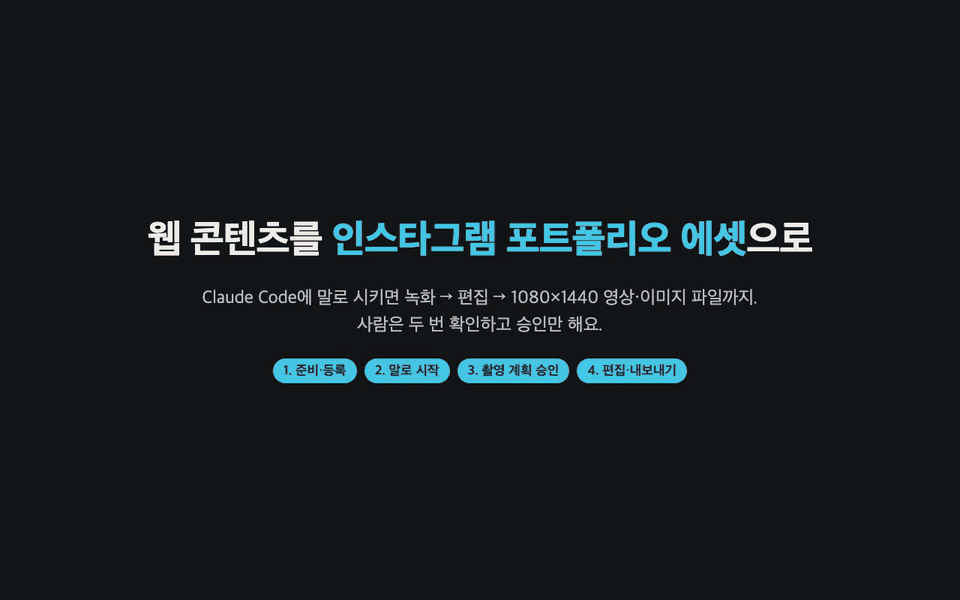

# 웹 콘텐츠 포트폴리오 에셋 하네스

직접 만든 웹 콘텐츠(웹사이트·웹 앱)를 화면 녹화해서 인스타그램 게시물 에셋(이미지·영상) 파일로 만드는 작업 틀이에요.
촬영 계획부터 녹화, 편집, 내보내기, 검사까지 정해진 순서대로 진행하고, 결과는 이 폴더 안에 파일로 쌓여요.
Figma는 쓰지 않아요.



> 소리 없는 1분짜리 미리보기예요. 테스트용 예시 사이트로 만들었고, 선명한 버전은 [docs/demo.mp4](docs/demo.mp4)예요.

## 사용 방법 (4단계)

1. **설치하고 프로젝트를 등록해요.**
   `npm install` → `npx playwright install chromium` → `npm test`가 통과하면 준비 끝이에요 (자세한 건 아래 "처음 준비하기").
   `projects.example.yaml`을 `projects.yaml`로 복사해 웹 콘텐츠 주소와 `<title>`을 적어요 (아래 "새 프로젝트 추가하기").
2. **Claude Code에 "\<프로젝트\> 하네스 시작해줘"라고 말해요.**
   AI가 사이트를 둘러보고 어떤 장면을 찍을지 정한 뒤, 360×640 화면을 3배 화질로 녹화해요.
3. **녹화본을 보고 "\<프로젝트\> 촬영 계획 승인"이라고 말해요.**
   `runs/<프로젝트>/raw/`의 영상과 장면 모음(1초 간격)을 확인해요. 바꾸고 싶으면 말로 피드백하면 다시 찍어요.
4. **에셋 편집 화면에서 다듬고 "내보내기" → "\<프로젝트\> 완성본 승인".**
   `npm run review -- <프로젝트>`로 화면을 열어 구간·재생 속도·배경색을 고치고 **내보내기**를 누르면 파일이 만들어지고 자동 검사가 돌아요.
   결과는 `runs/<프로젝트>/export/`에 1080×1440 mp4·png로 쌓여요.

미리보기 영상은 끝까지 진행한 프로젝트로 `node docs/make-demo.mjs <프로젝트>`를 실행하면 다시 만들 수 있어요.

## 무엇을 만드나요

한 번에 프로젝트 하나의 게시물 에셋 한 벌을 만들어요.

- 1080×1440(3:4) 캔버스, 에셋 5~10개 (별도 요청이 있으면 그 수)
- 영상은 MP4(H.264, 30fps, 20초 이하)이고 화면 1개만 넣어요. 이미지는 PNG이고 화면 1~3개를 넣을 수 있어요.
- 게시 문구 작성과 인스타그램 게시는 하지 않아요. 에셋 파일까지만 만들고 멈춰요.

## 어떤 순서로 진행되나요

| 단계 | 하는 일 | 맡는 쪽 |
|---|---|---|
| 1. 촬영 계획 | 웹 콘텐츠를 둘러보고 에셋 목록과 녹화 시나리오를 써요 | planner, explore.mjs |
| 2. 녹화 | 시나리오대로 360×640 화면을 3배(1080×1920)로 녹화해요 | record.mjs |
| ✋ 승인 1 | 에셋 목록과 녹화본을 보고 승인하거나 거절해요 | 사람 |
| 3. 편집값 | 녹화본을 보고 구간·재생 속도·추출 시점·배경색을 제안해요 | editor |
| 4. 내보내기·검사 | 편집값대로 파일을 만들고 크기·길이·빈 화면·배경색·루프 이음매를 확인해요 | export.mjs, judge.mjs |
| ✋ 승인 2 | 검토 화면에서 결과를 보며 고친 뒤 승인하거나 거절해요 | 사람 |

- 통과·실패는 AI가 아니라 검사 스크립트가 정해요.
- 4단계에서 통과하지 못하면 3단계로 돌아가 고쳐요. 여러 번 실패하면 멈추고 사람에게 물어봐요.

## 검토 화면

```bash
npm run review -- my-project
```

브라우저에서 `http://127.0.0.1:4455/`가 열려요. 다른 프로젝트의 검토 화면이 이미 그 포트를 쓰고 있으면 4456, 4457…처럼 다음 빈 포트로 열리고, 터미널에 주소와 프로젝트 이름이 나와요. 브라우저 탭 제목에도 프로젝트 이름이 보여요. 화면은 영상 편집 앱처럼 나뉘어 있어요: 왼쪽 **게시물 순서**, 가운데 **미리보기**, 오른쪽 **설정 패널**(에셋 설정 · 전체 스타일 · 자동 검사), 아래 **타임라인**(구간 자르기 · 장면 고르기). 오른쪽 위 `?`에 사용 방법이 있고, 항목 옆 ⓘ에 마우스를 올리면 설명이 나와요.

여기서 할 수 있는 일:

- 에셋을 게시물 순서대로, 실제 캔버스 비율로 보기
- 영상 구간의 시작·끝을 타임라인에서 끌거나 1프레임씩 옮기기 (노란 눈금은 장면 전환 시점이에요)
- 재생 속도 바꾸기 (0.8x~2.0x 버튼 또는 직접 입력) — 미리보기가 그 속도로 재생되고 결과 길이가 바로 다시 계산돼요
- 이미지에 넣을 화면의 시점과 화면 수(1·2·3개) 바꾸기
- 배경색, 테두리색·두께, 모서리 반경을 모든 에셋에 한 번에 바꾸기
- 에셋 순서 바꾸기, 빼기, 더하기
- 반복 재생(루프) 영상의 이음새를 확인하고, 자연스러운 시작 지점 찾기

바꾼 값은 `runs/<프로젝트 이름>/edit/edits.json`에 바로 저장돼요.
"편집 미리보기"는 녹화본을 브라우저에서 배치해 보여 주는 것이고, 오른쪽 위 **"내보내기"**를 눌러야 실제 파일이 만들어지고 자동 검사가 돌아요.
에셋마다 "반영됨 / 수정됨 / 새 항목 / 중복" 표시로 지금 파일이 편집 내용과 같은지 알 수 있어요.
실행 취소(⌘Z)·다시 실행(⇧⌘Z)이 있고, 영상은 Space(재생/일시정지), ←→(한 프레임), I·O(시작·끝 지점) 단축키를 쓸 수 있어요.
승인과 거절은 이 화면이 아니라 Claude Code에 말로 해요.

## 처음 준비하기

필요한 것: macOS(확인한 환경), node 22.2 이상, ffmpeg(9.0에서 확인), [Claude Code](https://claude.com/claude-code).

1. node와 ffmpeg를 확인해요.

   ```bash
   node -v
   ffmpeg -version   # 없으면 brew install ffmpeg
   ```

2. 녹화 엔진 `walkthrough-recorder`(별도 레포)를 받고, `package.json`이 그 위치를 가리키게 해요. 지금 `package.json`의 경로는 이 하네스를 만든 컴퓨터 기준이라 그대로는 맞지 않아요.

   ```bash
   # 받은 위치에 맞게 한 번만
   npm pkg set dependencies.walkthrough-recorder=file:<walkthrough-recorder 폴더 경로>
   # 녹화 엔진이 GitHub에 올라가 있으면
   npm pkg set dependencies.walkthrough-recorder=github:<계정>/walkthrough-recorder
   ```

   경로가 틀려도 `npm install`은 오류 없이 끝나요. 4번의 `npm test`가 잡아 줘요.

3. 패키지와 브라우저를 설치해요.

   ```bash
   npm install
   npx playwright install chromium
   ```

4. 준비가 잘 됐는지 확인해요. 먼저 실행 환경(node 버전, ffmpeg, 녹화 엔진, chromium)을 검사하고, 가짜 녹화본으로 전체 흐름을 돌려 봐요. 실제 사이트는 열지 않아요.

   ```bash
   npm test
   ```

## 사용하기

Claude Code에 말로 시키면 돼요.

| 이렇게 말하면 | 이렇게 움직여요 |
|---|---|
| "my-project 하네스 시작해줘" | 1단계부터 시작해요 |
| "my-project 이어서 해줘" | 멈춘 곳 다음부터 이어서 해요 |
| "my-project 촬영 계획 승인" | 편집 단계로 넘어가요 |
| "my-project 촬영 계획 거절: 결과 화면도 넣어줘" | 요청을 반영해 계획을 다시 써요 |
| "my-project 검토 화면 열어줘" | 검토 화면을 열어요 |
| "my-project 완성본 승인" | 끝나요 |
| "my-project 완성본 거절: 2번 영상 더 빠르게" | 요청을 반영해 편집값을 다시 써요 |

지금 어디까지 했는지는 이 명령으로 볼 수 있어요.

```bash
npm run status -- my-project
```

결과 에셋은 `runs/<프로젝트 이름>/export/` 폴더에 쌓여요. `runs/`는 GitHub에 올라가지 않아요 (계획·녹화·편집값·결과가 모두 이 컴퓨터에만 남아요).

## 새 프로젝트 추가하기

`projects.example.yaml`을 `projects.yaml`로 복사하고(`cp projects.example.yaml projects.yaml`) 아래처럼 적어요. `projects.yaml`은 클라이언트 주소가 들어가서 GitHub에 올라가지 않아요.

```yaml
my-project:
  url: http://localhost:4400     # 끝에 "/" 없이
  title: 내 프로젝트             # 그 페이지의 <title>. 다른 앱을 녹화하는 실수를 막아요
  target: local                  # 배포된 주소면 deployed
  allow_writes: false            # true면 저장·업로드 같은 요청을 막지 않아요
```

- `target: local`이면 dev 서버를 먼저 띄워 두세요. 포트가 다른 프로젝트와 겹치면 `<title>` 확인에서 멈춰요.
- 에셋 수나 영상 길이를 다르게 하고 싶으면 `asset_count`, `max_video_seconds`를 함께 적어요.

## 자주 묻는 질문

<details>
<summary><b>1. 에셋 편집 화면에서 고쳤는데 mp4 파일이 그대로예요.</b></summary>

편집 내용은 `edits.json`에 자동 저장되지만, 파일은 오른쪽 위 **내보내기**를 눌러야 다시 만들어져요.
위쪽에 "파일 미반영 N개"가 보이거나 에셋에 "수정됨"·"새 항목" 표시가 있으면 아직 반영되지 않은 거예요.
"완성본 승인"도 마지막으로 내보낸 파일 기준이라, 내보내지 않고 승인을 말하면 Claude가 먼저 내보내고 다시 확인을 받아요.
</details>

<details>
<summary><b>2. <code>npm install</code>은 됐는데 <code>npm test</code>가 "실행 환경 FAIL"로 멈춰요.</b></summary>

대부분 녹화 엔진 `walkthrough-recorder`의 위치가 맞지 않아서예요. 경로가 틀려도 `npm install`은 오류 없이 끝나요.
녹화 엔진을 받은 뒤 `npm pkg set dependencies.walkthrough-recorder=file:<폴더 경로>`로 위치를 맞추고 `npm install`을 다시 실행해요.
그 밖의 원인은 메시지에 그대로 나와요: node 22.2 미만, ffmpeg 없음(`brew install ffmpeg`), chromium 없음(`npx playwright install chromium`).
</details>

<details>
<summary><b>3. 녹화된 조작이 너무 느리거나 스크롤이 기계 같아요. 어디서 고치나요?</b></summary>

두 가지 방법이 있어요.

- **녹화를 다시 찍기**: 촬영 계획 승인 단계에서 말로 피드백해요. 예: "my-project 촬영 계획 거절: 버튼 사이 간격을 절반으로, 스크롤은 사람처럼". 조작 사이 간격, 스크롤 방식, 검색어, 장면 구성이 바뀌어요.
- **재생 속도만 바꾸기**: 에셋 편집 화면의 재생 속도(0.8x~2.0x)를 써요. 다시 찍지 않아도 되지만, 화면 애니메이션까지 함께 빨라져요.

조작 사이 간격만 줄이고 싶으면 다시 찍는 쪽이 자연스러워요.
</details>

<details>
<summary><b>4. 하네스가 "STOP"으로 멈췄어요.</b></summary>

`npm run status -- <프로젝트>`의 `reason`에 이유가 나와요. 흔한 경우는 아래와 같아요.

- 실행 환경 문제 (2번 질문)
- 거절이나 자동 검사 실패가 `rules.yaml`의 `retry` 횟수를 넘음
- 같은 문제를 에이전트가 고치지 못함

원인을 확인한 뒤 Claude Code에 "\<프로젝트\> 계속 진행해"라고 말하면 이어서 해요.
에셋 편집 화면에서 직접 고치고 내보내기를 눌러 검사를 통과시켜도 돼요.
</details>

<details>
<summary><b>5. 녹화하다가 사이트에 데이터가 저장되거나, 로그인이 필요한 사이트는 어떻게 하나요?</b></summary>

기본값(`allow_writes: false`)에서는 POST·PUT·PATCH·DELETE 요청을 막아서 사이트에 아무것도 저장되지 않아요. 방문 통계(analytics) 요청도 같이 막혀요.
읽기에 POST를 쓰는 사이트라 화면이 안 나오면, 그 주소만 `allow_post`에 적어 통과시켜요.
저장·업로드 장면까지 찍어야 하면 `allow_writes: true`로 직접 바꿔요. 이때 어떤 요청이 몇 번 나갔는지 촬영 계획 승인 때 보여 줘요.
로그인이 필요한 사이트는 아직 지원하지 않아요. 로컬 dev 서버는 `target: local`로 등록하고 서버를 먼저 띄워 두면 돼요.
</details>

## 주요 파일

| 파일 | 내용 |
|---|---|
| `prd.md` | 무엇을 왜 만드는지, 규격, 기능 요구사항 |
| `story-service.md` | 보는 사람·만드는 사람과 지켜야 할 것 |
| `story-work.md` | 손으로 하던 작업 흐름 |
| `rules.yaml` | 검사 기준 숫자와 규칙 |
| `projects.example.yaml` | 프로젝트 등록 예시. `projects.yaml`로 복사해서 써요 (복사한 `projects.yaml`은 git에 올라가지 않아요) |
| `CLAUDE.md` | Claude가 따르는 진행 순서 |
| `inputs/` | 작업 목적, 순서, 역할 정리 |
| `.claude/agents/` | 에이전트별 지시문 (planner, editor) |
| `scripts/` | 둘러보기, 녹화, 내보내기, 검사, 검토 화면, 진행 관리 스크립트 |

## 고칠 때 지킬 것

- 기준 숫자는 `rules.yaml`에만 적어요. 다른 문서에는 이름만 적어요.
- 에이전트는 자기 폴더만 고쳐요. 녹화 대상 레포의 소스는 고치지 않아요.
- 녹화 배율(3)은 바꾸지 않아요. 크기는 내보낼 때 축소로 맞춰요.
- `rules.yaml`이나 `scripts/`를 고쳤으면 `npm test`를 다시 돌려요.
