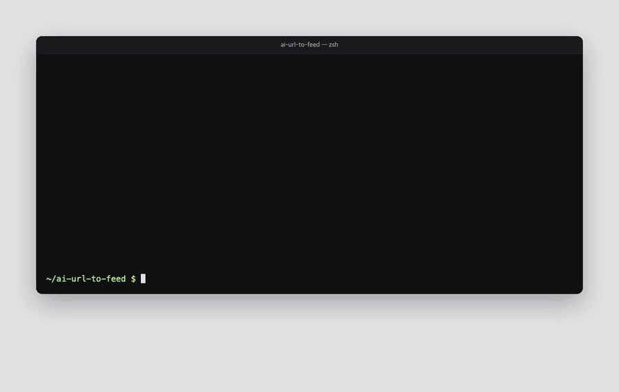
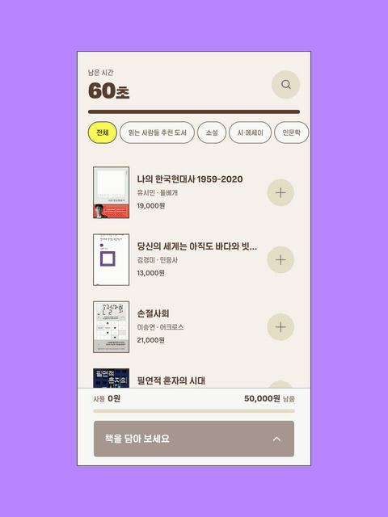
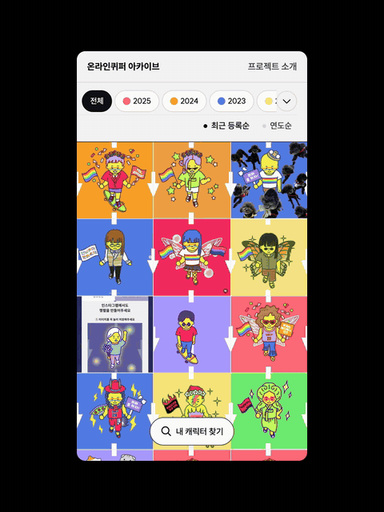

# ai-url-to-feed

**URL만 넣으면 인스타그램에 업로드가능한 3:4 비율의 영상・이미지를 만들어요.**



<sub>터미널 명령어로 스튜디오 웹사이트 URL과 배경색 코드만 전달하고, 피드용 게시물이 생성되는 과정</sub>


## 예시 결과



<sub>예시 1. 담기만 해도 독서다 URL(kyobobookdamgi.com)을 기반으로 생성된 인스타그램 피드용 게시물</sub>


<sub>예시 2. 온라인퀴퍼 아카이브 URL(online.sqcf.org) 메인 탐색</sub>


 


<sub>예시 3. 온라인퀴퍼 아카이브 URL(online.sqcf.org)로 생성된 인스타그램 피드용 게시물. 검색 및 탐색 과정은 Claude Code로 조정했다.</sub>

## 빠른 시작

```bash
git clone https://github.com/tadkim/ai-url-to-feed.git && cd ai-url-to-feed
npm install                                      # 녹화용 브라우저 설치와 ffmpeg 확인까지 함께
npx ai-url-to-feed stuckyi.studio --bg=#B987FF   # 주소와 배경색. https:// 는 빼도 돼요
```

기다리면 `runs/stuckyi/export/`에 `01.mp4`, `02.png` … 5~10개가 생겨요. 번호 순서대로 올리면 돼요.

## 요구 환경

| 항목 | 내용 |
|---|---|
| OS | macOS |
| 패키지 | Node.js 22.2+ · ffmpeg (`brew install ffmpeg`) |
| AI 도구 | [Claude Code](https://claude.com/claude-code) (설치 뒤 `claude`로 한 번 로그인) |

## 라이선스

| 구성 요소 | 라이선스 | 비고 |
|---|---|---|
| ai-url-to-feed (이 저장소) | MIT | [LICENSE](LICENSE) · Copyright (c) 2026 tadkim |
| [walkthrough-recorder](https://github.com/tadkim/walkthrough-recorder) | MIT | 녹화 엔진 · Copyright (c) 2026 tadkim |
| [Playwright](https://github.com/microsoft/playwright) | Apache-2.0 | 브라우저 제어·녹화 |
| [Lucide](https://lucide.dev) | ISC | 화면 아이콘 |
| [yaml](https://github.com/eemeli/yaml) | ISC | 설정 파일 읽기·쓰기 |
| [ffmpeg-static](https://github.com/eugeneware/ffmpeg-static) | GPL-3.0-or-later | walkthrough-recorder가 설치하는 ffmpeg 실행 파일 |
| [FFmpeg](https://ffmpeg.org) | LGPL-2.1+ / GPL-2.0+ (빌드 설정에 따라) | 별도 설치 (`brew install ffmpeg`) · 영상 합성·검사 |
