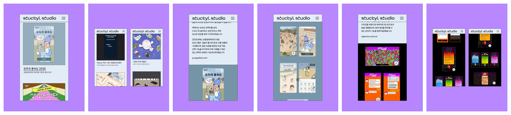

# ai-url-to-feed

**URL만 넣으면, 인스타그램에 바로 올릴 수 있는 3:4 영상·이미지가 나와요.**

[](https://github.com/tadkim/ai-url-to-feed/actions/workflows/test.yml)


<sub>빈 폴더에서 아래 명령 그대로 [stuckyi.studio](https://stuckyi.studio)를 처음부터 만든 실제 터미널 출력을 재생했어요 (실제 12분 7초). 위쪽 자막만 덧붙였고 기다리는 시간은 줄였어요 · 선명한 버전 [cli.mp4](docs/assets/cli.mp4)</sub>

## 빠른 시작

```bash
git clone https://github.com/tadkim/ai-url-to-feed.git && cd ai-url-to-feed
npm install                                      # 녹화용 브라우저 설치와 ffmpeg 확인까지 함께
npx ai-url-to-feed stuckyi.studio --bg=#B987FF   # 주소와 배경색. https:// 는 빼도 돼요
```

**필요한 것**: macOS · Node.js 22.2+ · ffmpeg · [Claude Code](https://claude.com/claude-code) (설치 뒤 `claude`로 한 번 로그인). 이 명령이 Claude Code를 대신 띄워 끝까지 진행해요. 확인하거나 승인할 단계는 없어요.

## 만들어지는 것



<sub>위 명령으로 만든 실제 결과 6개 (영상은 한 장면). 순서대로 01 영상 · 02 이미지 · 03 영상 · 04 이미지 · 05 영상 · 06 이미지</sub>

| 항목 | 내용 |
|---|---|
| 위치 | `runs/<프로젝트>/export/`의 `01.mp4`, `02.png` … 5~10개. 번호 순서대로 올리면 돼요 |
| 규격 | 1080×1440 (인스타그램 3:4). 영상은 20초 이하·소리 없음, 이미지는 화면 1~3개를 나란히 |
| 화면 | 사이트를 모바일 화면(360×640)으로 3배 화질 녹화. 배경색은 `--bg`, 없으면 AI가 골라요 |
| 검사 | 크기·길이·빈 화면·배경색·같은 화면 반복·멈춘 영상을 검사해서, 걸리면 AI가 고쳐 다시 만들어요 |
| 시간·비용 | stuckyi.studio 실측 약 12분, Claude Code 사용량 $2.4~2.6 (API 요금 기준). 끝날 때 터미널에 나와요 |

## 명령

| 명령 | 하는 일 |
|---|---|
| `npx ai-url-to-feed <주소>` | 등록하고 끝까지 만들어요. 같은 주소로 다시 실행하면 멈춘 곳부터 이어서 해요 |
| `npx ai-url-to-feed <주소> --bg=#FDE68A --count=6` | 배경색 · 게시물 수 (기본 5~10개). 바꿔서 다시 실행하면 그 설정으로 다시 만들어요 |
| `npx ai-url-to-feed status <프로젝트>` | 진행 상황 |
| `npx ai-url-to-feed open <프로젝트>` | 결과 폴더 열기 |
| `npx ai-url-to-feed continue <프로젝트>` | 멈춘 곳부터 다시 (Ctrl+C로 멈췄거나 오류로 멈췄을 때) |
| `npx ai-url-to-feed delete <프로젝트>` | 사이트와 만든 기록 삭제 (진행 중이면 멈추고, `--keep`이면 게시물 파일은 남겨요) |

`<프로젝트>`는 주소로 정해지는 이름이에요 (`stuckyi.studio` → `stuckyi`).

## 하네스가 하는 일

AI가 정해진 순서와 기준대로 일하게 묶어 두는 틀(하네스)이 URL 하나를 게시물 파일까지 끌고 가요. AI(planner)가 사이트를 둘러보고 찍을 장면을 정하면 스크립트가 녹화하고, AI(editor)가 쓸 구간·속도를 정하면 스크립트가 1080×1440으로 합성해 검사해요. 통과·실패는 AI가 아니라 검사 스크립트가 정해요. 화면을 선명하게 찍는 녹화 엔진은 [walkthrough-recorder](https://github.com/tadkim/walkthrough-recorder)예요. 자세한 내용은 [동작 방식](docs/how-it-works.md)에 있어요.

## 편집 화면 (작업 중)

자동으로 만든 결과를 브라우저에서 직접 고치는 화면(구간·재생 속도·배경색)도 있어요. 아직 다듬는 중인 기능이라 꼭 쓰지 않아도 돼요. `npx ai-url-to-feed <주소> --edit`로 실행하면 다 만든 뒤 열려요. → [편집 화면](docs/editor.md)

## 할 수 없는 것

- 로그인이 필요한 사이트, 데스크톱 화면 크기 녹화
- 4:5·9:16 등 다른 규격, 소리·자막 넣기
- 게시 문구 작성, 인스타그램 업로드

| OS | 확인 범위 |
|---|---|
| macOS | 실제 사이트로 처음부터 끝까지 실행 + 자동 테스트 |
| Linux (Ubuntu) · Windows | 자동 테스트만 (푸시마다 GitHub Actions). 실제 사이트 녹화는 미확인 |

## 문서

| 문서 | 내용 |
|---|---|
| [시작하기](docs/getting-started.md) | 설치부터 첫 결과까지, 명령과 옵션 |
| [문제 해결](docs/troubleshooting.md) | 멈추거나 오류가 날 때 증상별 해결 |
| [자주 묻는 질문](docs/faq.md) | 시간·비용, 어떤 사이트에 쓰는지, 사이트에 기록이 남는지 |
| [설정](docs/configuration.md) | 사이트별 설정(`projects.yaml`)과 공통 규격(`rules.yaml`) |
| [동작 방식](docs/how-it-works.md) | AI와 스크립트의 역할, 자동 검사, 파일 위치 |
| [편집 화면](docs/editor.md) | (작업 중) 결과를 브라우저에서 직접 고치기 |

## 라이선스

| 구성 요소 | 라이선스 | 비고 |
|---|---|---|
| ai-url-to-feed (이 저장소) | MIT | [LICENSE](LICENSE) · Copyright (c) 2026 tadkim |
| [walkthrough-recorder](https://github.com/tadkim/walkthrough-recorder) | MIT | 녹화 엔진 · Copyright (c) 2026 tadkim |
| [Playwright](https://github.com/microsoft/playwright) | Apache-2.0 | 브라우저 제어·녹화 |
| [Lucide](https://lucide.dev) | ISC | 화면 아이콘 |
| [yaml](https://github.com/eemeli/yaml) | ISC | 설정 파일 읽기·쓰기 |
| [ffmpeg-static](https://github.com/eugeneware/ffmpeg-static) | GPL-3.0-or-later | walkthrough-recorder가 설치하는 ffmpeg 실행 파일 |
| [FFmpeg](https://ffmpeg.org) | LGPL-2.1+ / GPL-2.0+ (빌드 설정에 따라) | 별도 설치 (`brew install ffmpeg`) · 영상 합성·검사 |
