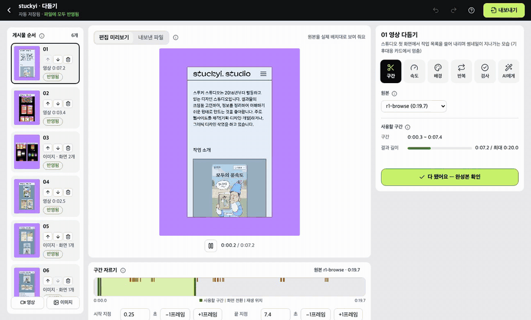

# ai-url-to-feed

**URL만 넣으면, 인스타그램에 바로 올릴 수 있는 3:4 영상·이미지가 나와요.**

[](https://github.com/tadkim/ai-url-to-feed/actions/workflows/test.yml)

| 지원 OS | 확인 범위 | 요구 사항 |
|---|---|---|
| macOS | 실제 사이트로 처음부터 끝까지 실행 + 자동 테스트 | Node.js 22.2+ · ffmpeg · [Claude Code](https://claude.com/claude-code) |
| Linux (Ubuntu) | 자동 테스트 (푸시마다 GitHub Actions) · 실제 사이트 녹화는 미확인 | 위와 같음 · 한글 글꼴 (`fonts-noto-cjk`) |
| Windows | 자동 테스트 (푸시마다 GitHub Actions) · 명령줄로 Claude Code 실행·실제 사이트 녹화는 미확인 | 위와 같음 · ffmpeg는 `choco install ffmpeg` 등 |


<sub>빈 폴더에서 위 명령 그대로 [stuckyi.studio](https://stuckyi.studio)를 처음부터 만든 실제 터미널 출력을 재생했어요 (실제 12분 7초, 게시물 6개, Claude Code 사용량 $2.63). 위쪽 자막만 덧붙였고 기다리는 시간은 줄였어요 · 선명한 버전 [cli.mp4](docs/assets/cli.mp4)</sub>

## 하네스가 하는 일

AI가 정해진 순서와 기준대로 일하게 묶어 두는 틀(하네스)이 URL 하나를 게시물 파일까지 끌고 가요. 사람이 하던 "무엇을 찍을지 정하고, 잘 찍혔는지 보고, 잘라서 배경에 얹는" 일을 대신해요.

| 단계 | 하네스가 하는 일 |
|---|---|
| 장면 정하기 | AI(planner)가 사이트를 둘러보고 찍을 흐름과 녹화 시나리오를 쓰고, 미리 돌려 보며 고쳐요 |
| 녹화 | 시나리오대로 모바일 화면을 3배 화질로 찍어요. 사이트에 기록이 남지 않게 저장 요청은 막아요 |
| 게시물 만들기 | AI(editor)가 쓸 구간·재생 속도를 정하고, 1080×1440 배치·배경색·테두리로 합성해요 |
| 자동 검사 | 크기·길이·빈 화면·배경색에 더해 같은 화면이 두 번 나오는지, 영상이 실제로 움직이는지 검사해서, 걸리면 AI에게 돌려보내 다시 고치게 해요 |
| 진행 관리 | 단계마다 상태를 남겨 멈춘 곳부터 이어서 하고, 재시도 횟수와 AI가 고칠 수 있는 범위를 지켜요 |

화면을 선명하게 찍는 녹화 엔진은 [walkthrough-recorder](https://github.com/tadkim/walkthrough-recorder)를 써요. 하네스는 그 엔진에 무엇을 찍을지 정해 주고, 결과를 검사하고, 게시물로 만들어요. 자세한 내용은 [동작 방식](docs/how-it-works.md)에 있어요.

## 빠른 시작

```bash
git clone https://github.com/tadkim/ai-url-to-feed.git && cd ai-url-to-feed
npm install                                      # 녹화용 브라우저 설치와 ffmpeg 확인까지 함께
npx ai-url-to-feed stuckyi.studio --bg=#B987FF   # 주소와 배경색. https:// 는 빼도 돼요
```

끝이에요. 진행 상황은 터미널에 진행 막대로 보이고, 기다리면 `runs/stuckyi/export/`에 `01.mp4`, `02.png` … 5~10개가 생겨요. 순서대로 인스타그램에 올리면 돼요.

- **확인·승인 없이 끝까지 가요.** AI가 사이트를 둘러보고 장면을 정해 녹화하고, 구간·속도를 정해 1080×1440 파일을 만든 뒤 자동 검사까지 해요. 한 프로젝트에 5~25분이에요.
- **Claude Code 창을 따로 열지 않아도 돼요.** 이 명령이 Claude Code를 대신 띄워 진행해요 (`claude -p`).
- **필요한 것**: macOS · Node.js 22.2+ · ffmpeg · [Claude Code](https://claude.com/claude-code) (설치 뒤 `claude`로 한 번 로그인)

| 옵션 | 하는 일 |
|---|---|
| `--bg=#B987FF` | 배경색. 없으면 AI가 사이트와 잘 구분되는 색을 골라요 |
| `--count=6` · `--count=5-8` | 게시물 수 (기본 5~10개) |
| `--edit` | 다 만든 뒤 편집 화면을 열어 직접 다듬어요 ([아래](#필요하면-직접-다듬기)) |
| `--local --title="내 앱"` | 내 컴퓨터의 개발 서버 (`localhost:3000`이면 `--local`은 생략) |

| 만든 뒤 | 명령 |
|---|---|
| 진행 상황 | `npx ai-url-to-feed status stuckyi` |
| 결과 폴더 열기 | `npx ai-url-to-feed open stuckyi` |
| 배경색만 바꿔 다시 만들기 | `npx ai-url-to-feed stuckyi.studio --bg=#FDE68A` |
| 멈췄을 때 이어서 하기 | `npx ai-url-to-feed continue stuckyi` |

같은 주소로 다시 실행하면 멈춘 곳부터 이어서 해요. `stuckyi`는 주소로 정해지는 프로젝트 이름이에요. 단계별 설명은 [시작하기](docs/getting-started.md)에 있어요.

## 필요하면 직접 다듬기

- **언제**: 자동으로 만든 결과에서 구간·속도·배경색을 내 취향대로 바꾸고 싶을 때
- **띄우기**: `npx ai-url-to-feed stuckyi.studio --edit` → 다 만든 뒤 브라우저에 편집 화면이 열려요
- **더 할 수 있는 것**: 미리보기를 보며 게시물마다 구간·재생 속도·배경색을 고치고, 게시물처럼 넘겨 본 뒤 승인해요



자세한 사용법은 [편집 화면](docs/editor.md), 진행 상황을 브라우저로 보는 방법은 [시작하기](docs/getting-started.md#화면으로-진행하기-선택)에 있어요.

## 할 수 있는 것 · 할 수 없는 것

| 할 수 있어요 | 할 수 없어요 |
|---|---|
| 배포된 사이트, 내 컴퓨터의 개발 서버 녹화 | 로그인이 필요한 사이트 |
| 모바일 화면(360×640)을 3배 화질로 녹화 | 데스크톱 화면 크기 녹화 |
| 인스타그램 3:4(1080×1440) 게시물 | 4:5, 9:16 등 다른 규격 |
| 영상(화면 1개)·이미지(화면 1~3개) 섞어 5~10개 | 영상 한 장에 화면 2개 이상 |
| 터미널 한 줄(주소·배경색·게시물 수)로 승인 없이 끝까지 자동 생성 | 게시 문구 작성, 인스타그램 업로드 |
| 크기·길이·빈 화면·배경색 자동 검사 | 소리, 글자·자막 넣기 |
| 원할 때만: 구간·재생 속도·배경색·테두리 편집, 다시 찍기 요청 | |
| 사이트에 데이터를 남기지 않고 녹화 | |

## 문서

| 문서 | 내용 |
|---|---|
| [시작하기](docs/getting-started.md) | 설치부터 완성까지, 명령줄 옵션, 화면으로 진행하기, 자동 생성·편집 모드 |
| [편집 화면](docs/editor.md) | 구간·속도·배경색 고치기, 내보내기, 단축키 |
| [동작 방식](docs/how-it-works.md) | 명령줄과 Claude Code, 하네스와 에이전트, 자동 검사, 폴더 구조 |
| [설정](docs/configuration.md) | 명령줄 옵션과 `projects.yaml`(사이트별 `mode`·`bg`·게시물 수), `rules.yaml`(공통 규격) |
| [자주 묻는 질문](docs/faq.md) | 코딩 몰라도 되는지, 시간·비용, 어떤 사이트에 쓰는지 |
| [문제 해결](docs/troubleshooting.md) | 증상별 원인과 해결 |

## 라이선스

| 구성 요소 | 라이선스 | 비고 |
|---|---|---|
| ai-url-to-feed (이 저장소) | MIT | [LICENSE](LICENSE) · Copyright (c) 2026 tadkim |
| [walkthrough-recorder](https://github.com/tadkim/walkthrough-recorder) | MIT | 녹화 엔진 · Copyright (c) 2026 tadkim |
| [Playwright](https://github.com/microsoft/playwright) | Apache-2.0 | 브라우저 제어·녹화 |
| [Lucide](https://lucide.dev) | ISC | 화면 아이콘 |
| [yaml](https://github.com/eemeli/yaml) | ISC | 설정 파일 읽기·쓰기 |
| [ffmpeg-static](https://github.com/eugeneware/ffmpeg-static) | GPL-3.0-or-later | walkthrough-recorder가 설치하는 ffmpeg 실행 파일 |
| [FFmpeg](https://ffmpeg.org) | LGPL-2.1+ / GPL-2.0+ (빌드 설정에 따라) | 별도 설치 (`brew install ffmpeg`) · 영상 합성·검사 |
