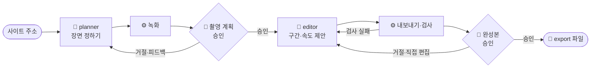

# 웹 콘텐츠 포트폴리오 에셋 하네스

**웹사이트 주소를 넣으면, 인스타그램 게시물용 영상·이미지 파일이 나와요.**


<sub>테스트용 예시 사이트로 만든 1분 미리보기 · 선명한 버전 [docs/demo.mp4](docs/demo.mp4)</sub>

## 이 문서를 따라 하면

웹사이트 1개로 인스타그램 게시물 1개 분량의 파일(1080×1440 영상·이미지 5~10개)을 만들어요.
AI가 녹화하고, 사람은 두 번 확인해서 승인해요. 준비를 마친 뒤 한 프로젝트에 30분~1시간 걸려요.

| 필요한 것 | 입력 | 결과 |
|---|---|---|
| macOS · node 22.2+ · ffmpeg · [Claude Code](https://claude.com/claude-code) | 웹사이트 주소 (내 컴퓨터의 개발 서버면 페이지 제목도) | `runs/<프로젝트>/export/`의 `01.mp4`, `02.png` … |

## 먼저 알아 둘 것

**하네스**는 AI가 정해진 순서와 기준대로 일하게 묶어 두는 틀이에요. 일은 셋이 나눠 맡아요.

| 누가 | 맡는 일 | 예 |
|---|---|---|
| 🧠 AI 에이전트 | 판단이 필요한 일 | **planner**: 찍을 장면 정하기 · **editor**: 쓸 구간·속도 제안 |
| ⚙️ 스크립트 | 정해진 일과 판정 | 녹화, 파일 만들기, 크기·길이·빈 화면 검사 |
| 🙋 사람 | 최종 결정 | 녹화본 승인, 완성본 승인 (Claude Code에 말로) |



통과·실패는 AI가 아니라 ⚙️ 검사 스크립트가 정해요. 여러 번 실패하면 멈추고 사람에게 물어요.

## 따라 하기

| 단계 | 하는 일 | 입력 | 결과 |
|---|---|---|---|
| 1. 준비하기 | 설치하고 검사 | 터미널 명령 3줄 | `86/86 PASS` |
| 2. 프로젝트 등록하기 | 녹화할 사이트 적기 | `projects.yaml` | 등록된 프로젝트 |
| 3. 녹화하기 | AI가 장면을 정해 녹화 → 사람이 승인 | `my-project 하네스 시작해줘` | `raw/` 녹화본 |
| 4. 다듬고 내보내기 | 편집 화면에서 고치고 내보내기 → 승인 | `npm run review -- my-project` | `export/` 게시물 파일 |

### 1. 준비하기 (처음 한 번)

설치하고 검사해요. 녹화 엔진 [walkthrough-recorder](https://github.com/tadkim/walkthrough-recorder)도 함께 설치돼요.

```bash
npm install
npx playwright install chromium
npm test
```

마지막 줄이 `86/86 PASS`면 준비가 끝났어요.

### 2. 프로젝트 등록하기

예시 파일을 복사해서 녹화할 사이트를 적어요.

```bash
cp projects.example.yaml projects.yaml
```

`projects.yaml`을 열어 `my-project` 부분을 고쳐요.

```yaml
projects:
  my-project:
    url: https://example.com   # 사이트 주소. 끝에 "/" 없이
    title: 예시 사이트          # 그 페이지의 <title>. 다른 사이트를 녹화하는 실수를 막아요
    target: deployed           # 내 컴퓨터에서 띄운 개발 서버면 local
    allow_writes: false        # 녹화 중 사이트에 데이터가 저장되지 않게 막아요
```

| 항목 | 뜻 | 값 |
|---|---|---|
| `url` | 녹화할 사이트 주소 | 끝에 `/` 없이 |
| `title` | 그 페이지의 `<title>` — 다른 사이트를 녹화하는 실수를 막아요 | 브라우저 탭 제목 그대로. 배포된 사이트는 생략해도 돼요 |
| `target` | 사이트 종류 | `deployed` 배포된 사이트 · `local` 내 컴퓨터의 개발 서버(먼저 띄워 둬요) |
| `allow_writes` | 녹화 중 저장 요청 허용 | `false` 막기(기본) · `true` 허용 |

`projects.yaml`은 git에 올라가지 않아요.

### 3. 녹화하기

Claude Code에 이렇게 말해요.

```text
my-project 하네스 시작해줘
```

AI가 사이트를 둘러보고 찍을 장면을 정한 뒤 녹화해요. 끝나면 `runs/my-project/raw/`에 녹화본(`.mp4`)과 1초 간격 장면 모음(`.sheet.png`)이 생기고, Claude가 확인을 요청해요.

녹화본을 보고 괜찮으면 승인하고, 바꾸고 싶으면 거절하면서 요청을 적어요.

```text
my-project 촬영 계획 승인
my-project 촬영 계획 거절: 버튼 사이 간격을 절반으로, 스크롤은 사람처럼
```

### 4. 다듬고 내보내기

AI가 구간과 속도를 제안해 파일을 만들면, 편집 화면을 열어 확인해요.

```bash
npm run review -- my-project
```

브라우저에서 구간·재생 속도·배경색을 고친 뒤 오른쪽 위 **내보내기**를 눌러요. 편집은 자동 저장되지만 **파일에는 내보내기를 눌러야 반영돼요.** 결과가 마음에 들면 Claude Code에 말해요.

```text
my-project 완성본 승인
```

`runs/my-project/export/`의 파일을 순서대로 인스타그램에 올리면 돼요.

## 다음 단계

| 하고 싶은 것 | 방법 |
|---|---|
| 다른 사이트 추가 | `projects.yaml`에 항목을 하나 더 적고 3번부터 해요. 프로젝트마다 따로 진행돼요 |
| 에셋 수·영상 길이 바꾸기 | 프로젝트 항목에 `asset_count: [5, 7]`, `max_video_seconds: 15`처럼 적어요 |
| 규격·검사 기준 바꾸기 | `rules.yaml`을 고친 뒤 `npm test`를 다시 돌려요 |

## 할 수 있는 것 · 할 수 없는 것

| 할 수 있어요 | 할 수 없어요 |
|---|---|
| 배포된 사이트, 내 컴퓨터의 개발 서버 녹화 | 로그인이 필요한 사이트 |
| 모바일 화면(360×640)을 3배 화질로 녹화 | 데스크톱 화면 크기 녹화 |
| 인스타그램 3:4(1080×1440) 게시물 | 4:5, 9:16 등 다른 규격 |
| 영상(화면 1개)·이미지(화면 1~3개) 섞어 5~10개 | 영상 한 장에 화면 2개 이상 |
| 구간·재생 속도·배경색·테두리·모서리 편집 | 소리, 글자·자막 넣기 |
| 크기·길이·빈 화면·배경색 자동 검사 | 게시 문구 작성, 인스타그램 업로드 |
| 사이트에 데이터를 남기지 않고 녹화 | |

macOS에서 확인했어요. Windows·Linux는 아직 돌려 보지 않았어요.

## 자주 묻는 질문

<details>
<summary><b>코딩을 몰라도 쓸 수 있나요?</b></summary>

준비할 때 터미널에 명령 몇 줄을 붙여 넣는 것만 필요해요. 그다음은 Claude Code에 말로 시키고, 편집은 브라우저 화면에서 해요. 녹화 시나리오 코드는 AI가 써요.
</details>

<details>
<summary><b>시간과 비용은 얼마나 드나요?</b></summary>

Claude Code 사용량이 들어요. 예시 프로젝트(영상·이미지 5개)에서 촬영 계획을 세 번 고쳤을 때 AI 작업에 약 33만 토큰, 23분 정도 걸렸어요. 녹화와 내보내기는 각각 1분 안팎이고, 여기에 사람이 확인하는 시간이 더해져요.
</details>

<details>
<summary><b>어떤 사이트에 쓸 수 있나요?</b></summary>

주소로 열리는 웹사이트와 내 컴퓨터에서 띄운 개발 서버요. 모바일 화면으로 녹화하니 모바일에서 잘 보이는 사이트가 좋아요. 로그인이 필요한 화면은 아직 못 찍어요. 직접 만들었거나 공개해도 되는 사이트에 써 주세요.
</details>

<details>
<summary><b>녹화하면 사이트에 기록이 남지 않나요?</b></summary>

기본으로 저장 요청(글 등록·업로드 등)과 방문 통계 요청을 막고 녹화해요. 저장 장면까지 찍어야 할 때만 `projects.yaml`에서 `allow_writes: true`로 직접 허용해요.
</details>

<details>
<summary><b>결과물은 어떻게 쓰나요?</b></summary>

`runs/<프로젝트>/export/`의 mp4·png를 인스타그램에 순서대로 올리면 돼요. 일반 파일이라 다른 편집 툴에서 더 고쳐도 돼요. 게시 문구 작성과 업로드는 직접 해요.
</details>

## 문제 해결

<details>
<summary><b>편집했는데 mp4가 그대로예요</b></summary>

**원인**: 편집 내용은 `edits.json`에만 저장되고, 파일은 다시 만들기 전까지 그대로예요. 화면 위쪽 "파일 미반영 N개"나 에셋의 "수정됨" 표시가 그 상태예요.

**해결**: 오른쪽 위 **내보내기**를 눌러요. "✓ 파일에 모두 반영됨"으로 바뀌면 끝이에요.
</details>

<details>
<summary><b><code>npm test</code>가 "실행 환경 FAIL"로 멈춰요</b></summary>

**원인**: 필요한 도구가 없거나 설치가 덜 됐어요. 메시지에 빠진 항목이 나와요.

**해결**: 해당 항목을 설치한 뒤 다시 `npm test`를 실행해요.

```bash
npm install                       # 녹화 엔진 등 패키지
brew install ffmpeg               # ffmpeg (macOS)
npx playwright install chromium   # 녹화용 브라우저
```
</details>

<details>
<summary><b>녹화된 조작이 느리거나 스크롤이 기계 같아요</b></summary>

**원인**: AI가 정한 조작 간격과 스크롤 방식이 의도와 달라요.

**해결**: 촬영 계획 단계라면 거절하면서 요청을 적어 다시 찍어요. 이미 편집 단계라면 편집 화면에서 재생 속도(0.8x~2.0x)를 올려요. 재생 속도는 화면 애니메이션까지 함께 빨라지니, 간격만 줄이려면 다시 찍는 쪽이 자연스러워요.
</details>

<details>
<summary><b>하네스가 STOP으로 멈췄어요</b></summary>

**원인**: 거절이나 자동 검사 실패가 `rules.yaml`의 `retry` 횟수를 넘었거나, 실행 환경에 문제가 있어요.

**해결**: 상태를 보고 원인을 고친 뒤 Claude Code에 `my-project 계속 진행해`라고 말해요.

```bash
npm run status -- my-project   # "reason"에 멈춘 이유가 나와요
```
</details>

## 참고

<details>
<summary><b>Claude Code에 하는 말</b></summary>

| 말 | 하는 일 |
|---|---|
| `<프로젝트> 하네스 시작해줘` / `이어서 해줘` | 처음부터 / 멈춘 곳부터 진행 |
| `<프로젝트> 촬영 계획 승인` / `거절: <요청>` | 녹화본 확정 / 요청대로 다시 찍기 |
| `<프로젝트> 검토 화면 열어줘` | 편집 화면 열기 |
| `<프로젝트> 완성본 승인` / `거절: <요청>` | 끝내기 / 요청대로 다시 편집 |
| `<프로젝트> 계속 진행해` | 멈춘(STOP) 하네스 다시 시작 |
</details>

<details>
<summary><b>편집 화면</b></summary>

| 위치 | 영역 | 하는 일 |
|---|---|---|
| 위 | 상단 바 | 진행 단계, 실행 취소, 반영 상태, **내보내기** |
| 왼쪽 | 게시물 순서 | 에셋 고르기·추가, 반영 상태 표시 |
| 가운데 | 미리보기 | 1080×1440 배치 그대로 재생 |
| 오른쪽 | 설정 | 에셋 설정 · 전체 스타일(배경색 등) · 자동 검사 |
| 아래 | 타임라인 | 영상 구간 자르기 / 이미지 장면 고르기 |

| 키 | 동작 |
|---|---|
| Space | 재생 / 일시정지 |
| ← → | 한 프레임 이동 |
| I · O | 현재 위치를 시작 · 끝 지점으로 |
| ⌘Z · ⇧⌘Z | 실행 취소 · 다시 실행 |

오른쪽 위 `?`에 사용 방법이 있어요.
다른 프로젝트 화면이 이미 열려 있으면 다음 빈 포트(4456…)로 열려요.
</details>

<details>
<summary><b>폴더와 파일</b></summary>

```text
runs/my-project/          ← 프로젝트마다 하나 (git에 올라가지 않아요)
├── plan/                 🧠 planner   에셋 목록, 녹화 시나리오
├── raw/                  ⚙️ 녹화      1080×1920 녹화본, 장면 모음
├── edit/edits.json       🧠 editor + 🙋 편집 화면   구간·속도·배경색
├── export/               ⚙️ 내보내기  01.mp4, 02.png … ← 게시할 파일
└── gate/                 ⚙️ 검사      검사 결과, 승인 기록
```

| 파일 | 내용 |
|---|---|
| `prd.md`, `story-*.md` | 무엇을 왜 만드는지, 지켜야 할 것 |
| `rules.yaml` | 규격·검사 기준 숫자 (숫자는 여기에만) |
| `projects.example.yaml` | 프로젝트 등록 예시 |
| `CLAUDE.md`, `.claude/agents/` | Claude가 따르는 진행 순서, 에이전트 지시문 |
| `scripts/` | 둘러보기·녹화·내보내기·검사·편집 화면 |
| `docs/make-demo.mjs` | 미리보기 영상 다시 만들기 (`node docs/make-demo.mjs <프로젝트>`) |
</details>

## 라이선스

MIT · 녹화 엔진 [walkthrough-recorder](https://github.com/tadkim/walkthrough-recorder)도 MIT
