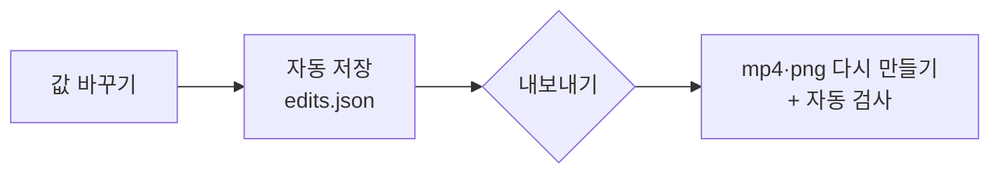

# 편집 화면

[← README](../README.md)

AI가 만든 결과를 그대로 써도 되고, 편집 화면에서 직접 다듬을 수도 있어요.


<sub>선명한 버전 [editor.mp4](assets/editor.mp4)</sub>

## 열기

AI가 게시물 파일을 만든 뒤(시작하기 5단계 이후)에 열어요.

```bash
npm run review -- my-site
```

브라우저에서 `http://127.0.0.1:4455/`가 열려요. 이 컴퓨터에서만 열리고, 터미널을 닫으면 화면도 꺼져요. 다른 프로젝트 화면이 이미 열려 있으면 다음 빈 포트(4456…)로 열려요.

## 고칠 수 있는 것

| 고칠 수 있는 것 | 방법 |
|---|---|
| 영상 구간 | 아래 타임라인의 파란 구간 양끝을 끌어요 |
| 재생 속도 | 0.8x · 1.0x · 1.2x · 1.5x · 2.0x 또는 직접 입력 |
| 배경색·테두리·모서리 | 전체 스타일 탭에서 한 번에 모든 에셋에 적용 |
| 이미지 장면·화면 수 | 원하는 순간을 고르고, 한 장에 화면 1~3개 |
| 순서·추가·삭제 | 왼쪽 게시물 순서에서 |

## 저장과 내보내기



- 편집 내용은 바로 자동 저장되지만 **파일에는 내보내기를 눌러야 반영돼요.**
- 반영 전이면 위쪽에 "파일 미반영 N개", 에셋에 "수정됨"이 보여요.

| 표시 | 뜻 |
|---|---|
| 반영됨 | 파일이 지금 편집 내용과 같아요 |
| 수정됨 | 고쳤지만 아직 내보내지 않았어요 |
| 새 항목 | 추가했지만 아직 내보내지 않았어요 |
| 중복 | 다른 에셋과 원본·구간이 같아요 |

## 화면 구성

| 위치 | 영역 | 하는 일 |
|---|---|---|
| 위 | 상단 바 | 진행 단계, 실행 취소, 반영 상태, **내보내기** |
| 왼쪽 | 게시물 순서 | 에셋 고르기·추가, 반영 상태 표시 |
| 가운데 | 미리보기 | 1080×1440 배치 그대로 재생 |
| 오른쪽 | 설정 | 에셋 설정 · 전체 스타일(배경색 등) · 자동 검사 |
| 아래 | 타임라인 | 영상 구간 자르기 / 이미지 장면 고르기 |

## 단축키

| 키 | 동작 |
|---|---|
| Space | 재생 / 일시정지 |
| ← → | 한 프레임 이동 |
| I · O | 현재 위치를 시작 · 끝 지점으로 |
| ⌘Z · ⇧⌘Z | 실행 취소 · 다시 실행 |

오른쪽 위 `?`에도 사용 방법이 있어요. 승인과 거절은 이 화면이 아니라 Claude Code에 말로 해요.
