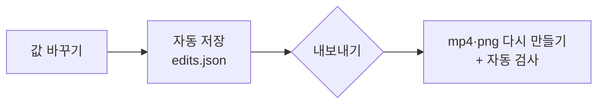

# 편집 화면

[← README](../README.md)

AI가 만든 결과를 그대로 써도 되고, 편집 화면에서 직접 다듬을 수도 있어요.

선명한 버전 [editor.mp4](assets/editor.mp4)

## 열기

AI가 게시물 파일을 만든 뒤에 열어요. 명령줄에 `--edit`를 붙이면(`npx ai-url-to-feed stuckyi.studio --edit`) 다 만든 뒤 이 화면이 자동으로 열려요. 화면으로 진행할 때 **편집 모드**면 파일이 만들어진 뒤 시작 화면의 **지금 할 일**에 **편집 화면에서 다듬기**가 나와요. 자동 생성으로 끝냈다면 완성 화면 아래 **편집 화면에서 다듬기**를 눌러요 (편집 모드로 바뀌어요).
주소는 `http://127.0.0.1:4455/p/<프로젝트>/edit/`이에요 (다른 화면이 이미 그 포트를 쓰면 4456…). 이 컴퓨터에서만 열리고, 화면을 띄운 터미널(`--edit`, `ui`, `npm start`)을 닫으면 화면도 꺼져요.

편집 화면만 따로 열려면 `npm run review -- <프로젝트>`

## 고칠 수 있는 것

| 고칠 수 있는 것 | 방법 |
|---|---|
| 영상 구간 | **구간** 도구. 아래 타임라인의 초록 구간 양끝을 끌어요 |
| 재생 속도 | **속도** 도구. 0.8x · 1.0x · 1.2x · 1.5x · 2.0x 또는 직접 입력 |
| 배경색·테두리·모서리 | **배경** 도구. 한 번에 모든 에셋에 적용 |
| 반복 재생 | **반복** 도구. 화면 속 애니메이션 주기를 넣으면 끝과 처음이 자연스럽게 이어지는 길이로 맞춰요 |
| 이미지 장면·화면 수 | 원하는 순간을 고르고, 한 장에 화면 1~3개 |
| 순서·추가·삭제 | 왼쪽 게시물 순서에서. 번호 아래 위·아래 버튼으로 순서, 휴지통으로 삭제, 맨 아래 영상·이미지로 추가 |
| 장면 자체 | **AI에게** 도구. 에셋에 고칠 점을 적어 보내면 AI가 다시 만들어요 (보낸 뒤 Claude Code에 `이어서 해줘`) |

## 저장과 내보내기

- 편집 내용은 바로 자동 저장되지만 **파일에는 내보내기를 눌러야 반영돼요.**
- 반영 전이면 제목 아래에 "파일 반영 전 N개", 에셋에 "수정됨"이 보여요.

| 표시 | 뜻 |
|---|---|
| 반영됨 | 파일이 지금 편집 내용과 같아요 |
| 수정됨 | 고쳤지만 아직 내보내지 않았어요 |
| 새 항목 | 추가했지만 아직 내보내지 않았어요 |
| 중복 | 다른 에셋과 원본·구간이 같아요 |

## 화면 구성

| 위치 | 영역 | 하는 일 |
|---|---|---|
| 위 | 상단 바 | 진행 화면으로(왼쪽 화살표), 저장·반영 상태, 실행 취소·다시 실행, 사용 방법, **내보내기** |
| 왼쪽 | 게시물 순서 | 에셋 고르기·추가, 반영 상태 표시 |
| 가운데 | 미리보기 | 1080×1440 배치 그대로 재생 |
| 오른쪽 | 도구 | 구간 · 속도 · 배경 · 반복 · 검사 · AI에게 중 하나를 골라 그 설정만 보여요 (이미지는 화면 · 배경 · 검사 · AI에게) |
| 아래 | 타임라인 | 영상 구간 자르기 / 이미지 장면 고르기 |

## 단축키

| 키 | 동작 |
|---|---|
| Space | 재생 / 일시정지 |
| ← → | 한 프레임 이동 |
| I · O | 현재 위치를 시작 · 끝 지점으로 |
| ⌘Z · ⇧⌘Z | 실행 취소 · 다시 실행 |

오른쪽 위 `?`에도 사용 방법이 있어요. 내보낸 뒤에는 도구 아래 **다 됐어요 — 완성본 확인**을 눌러 승인해요 (편집 모드). 거절했던 경우 완성본 확인의 **한눈에 보기**에서 이전 결과와 나란히 비교할 수 있어요.

휴대폰 화면에서는 미리보기 → 게시물 순서(가로로 넘김) → 설정 순서로 쌓이고, 도구는 아래에 고정돼요.
