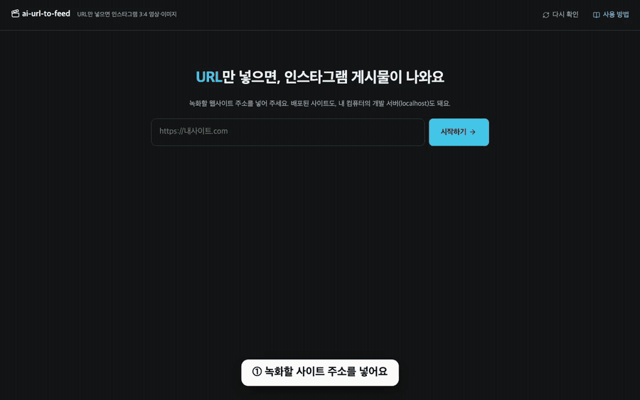
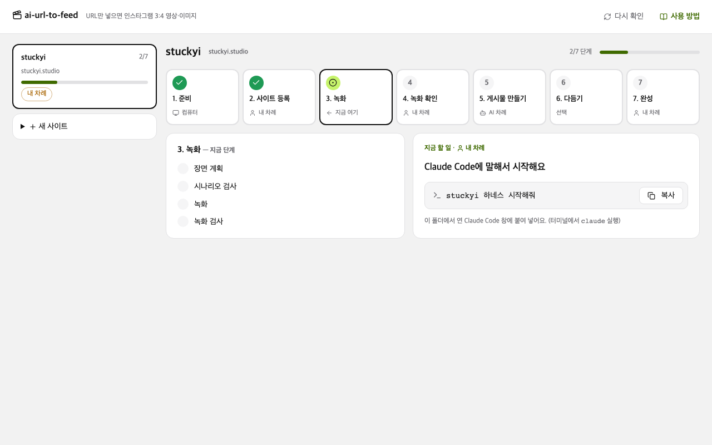
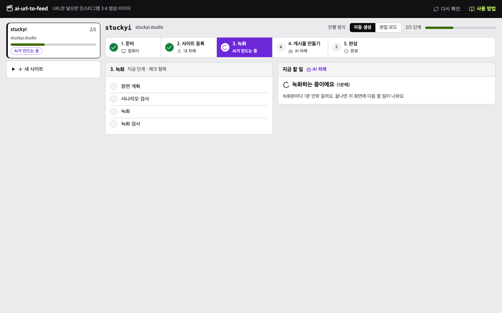
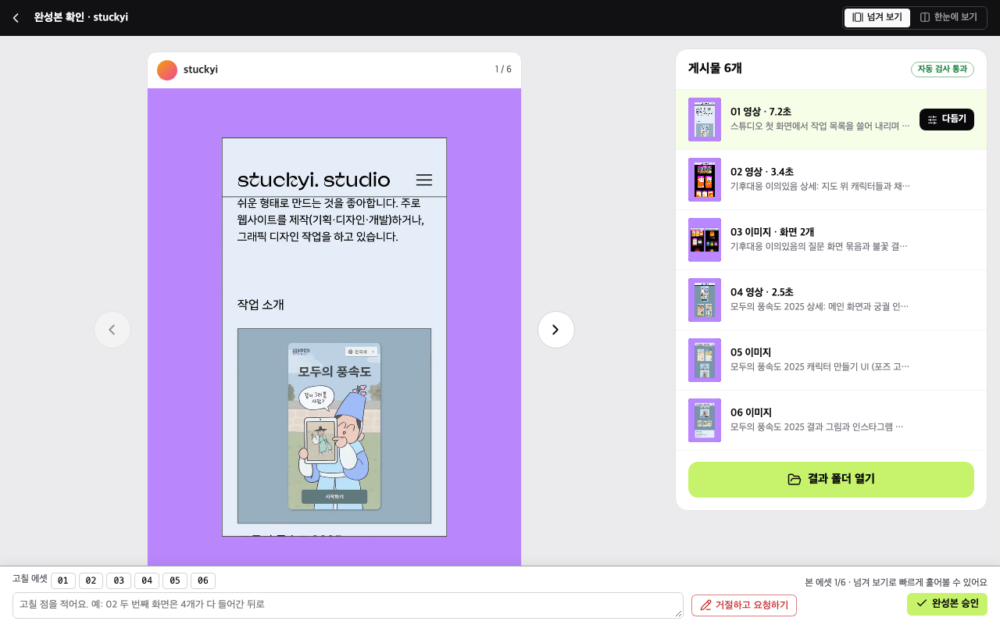
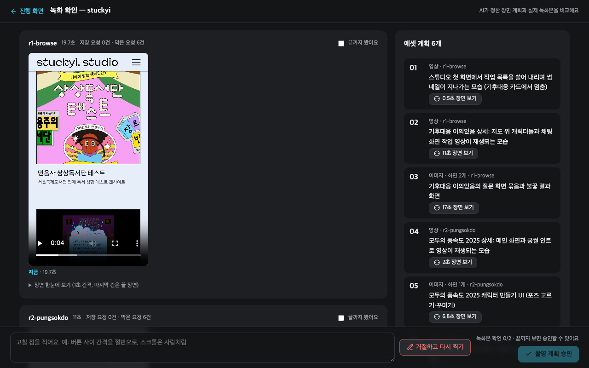

# 시작하기

[← README](../README.md)

이 문서를 따라 하면 웹사이트 1개로 인스타그램 게시물 1개 분량의 파일(1080×1440 영상·이미지 5~10개)을 만들어요.
기본은 **터미널에 주소 한 줄**이에요. 확인·승인 없이 끝까지 자동으로 만들고, 화면(HTML)은 원할 때만 열어요. AI 작업은 한 프로젝트에 5~25분이에요.
예시는 [stuckyi.studio](https://stuckyi.studio)로 진행한 실제 화면이에요.

## 설치 (한 번만)

| 도구 | 설치 |
|---|---|
| Node.js 22.2 이상 | [nodejs.org](https://nodejs.org) |
| ffmpeg | `brew install ffmpeg` (macOS, [Homebrew](https://brew.sh) 필요) |
| Claude Code | `npm install -g @anthropic-ai/claude-code` → `claude`를 한 번 실행해 로그인 |

```bash
git clone https://github.com/tadkim/ai-url-to-feed.git
cd ai-url-to-feed
npm install          # 녹화 엔진, 녹화용 브라우저(chromium) 설치와 ffmpeg 확인까지 함께
```

녹화 엔진 [walkthrough-recorder](https://github.com/tadkim/walkthrough-recorder)도 함께 설치돼요. 브라우저를 받지 못했다는 안내가 나오면 `npx playwright install chromium`을 직접 실행해요.

## 만들기 (터미널)

이 폴더에서 주소를 넣어 실행해요. `https://`는 빼도 돼요 (내 컴퓨터 주소 `localhost:3000`은 `http://`가 붙어요).

```bash
npx ai-url-to-feed stuckyi.studio --bg=#B987FF
```

진행 중에는 맨 아래 진행 막대가 계속 바뀌고, 끝난 단계는 그 위에 한 줄씩 남아요. AI가 일하는 동안에는 둘러본 화면 수, 미리 돌려 본 시나리오 수가 함께 늘어나서 멈춘 게 아닌 걸 알 수 있어요. 다 끝나면 걸린 시간과 Claude Code 사용량(API 요금 기준 금액)도 나와요.

```text
⠦ ░░░░░░░░░░░░░░░░░░░░   0% | 1/5 장면 계획 | AI가 작업 중이에요 (장면 계획·녹화 준비) · 화면 14개 둘러봄 | 02:38
```

다 끝나면 이렇게 남아요. 빈 폴더에서 위 명령으로 처음 만든 실제 화면이에요. 자동 검사에서 걸리면 AI가 고쳐 다시 만들고, 그 단계 줄이 한 번 더 남아요.

```text
환경 확인      Node 22.23.1 · ffmpeg · chromium 완료
사이트 등록    https://stuckyi.studio → stuckyi (새로 등록)  배경 #B987FF · 게시물 5~10개
✓ 장면 계획          08:31
✓ 녹화               01:12
✓ 구간·속도 정하기   01:58
✓ 파일 만들기        00:08
✓ 자동 검사          00:04
✓ ████████████████████ 100% | 5/5 완성 | 12:07

완성  runs/stuckyi/export/  01.mp4 02.png 03.mp4 04.png 05.mp4 06.png
  자동 모드 — 모든 자동 검사 PASS (사람 승인 없이 완성) · 12분 7초 · Claude Code 사용량 $2.63 (API 요금 기준, 21턴)
  결과 폴더 열기: npx ai-url-to-feed open stuckyi · 게시물처럼 넘겨 보기: npx ai-url-to-feed ui
```

1. 주소를 `projects.yaml`에 등록해요. 주소로 프로젝트 이름이 정해져요 (`stuckyi.studio` → `stuckyi`).
2. Claude Code를 화면 없이(`claude -p`) 띄워 `stuckyi 하네스 시작해줘`를 대신 말해요. Claude Code 창을 따로 열지 않아도 돼요.
3. AI가 사이트를 둘러보고 찍을 장면을 정해 녹화해요 (장면 계획 6~9분, 녹화 1~2분). 녹화 원본은 게시물의 재료라 30초가 넘어도 괜찮아요.
4. AI가 녹화본에서 쓸 구간과 재생 속도를 정하고, 스크립트가 1080×1440 파일을 만든 뒤 크기·길이·빈 화면·배경색을 자동 검사해요. 게시물 영상은 20초 이하예요. 검사에 걸리면 AI가 그 부분을 고쳐 다시 만들어요.
5. 통과하면 **완성**과 파일 목록이 나와요. `runs/stuckyi/export/`의 `01.mp4`, `02.png` … 를 순서대로 인스타그램에 올리면 돼요.

Claude Code가 한 일은 `runs/.harness/log/stuckyi-claude.log`에 남아요. 도중에 Ctrl+C로 멈췄으면 같은 명령을 다시 실행하면 이어서 해요.

### 옵션

| 옵션 | 하는 일 |
|---|---|
| `--bg=#B987FF` | 배경색. 없으면 AI가 사이트와 잘 구분되는 색을 골라요 |
| `--count=6` · `--count=5-8` | 게시물 수 (기본 5~10개) |
| `--edit` | 다 만든 뒤 편집 화면을 열어 다듬고 한 번 승인해요 (아래 [편집 모드](#편집-모드-다듬기승인)) |
| `--auto` | 편집 모드였던 사이트를 다시 자동 생성으로 |
| `--local --title="내 앱"` | 내 컴퓨터의 개발 서버. 서버를 먼저 띄워요. `--title`을 빼면 지금 페이지 제목을 적어요 |
| `--no-ai` | 등록만 하고 Claude Code에 붙여 넣을 문장을 보여 줘요 (대화하며 진행할 때) |

옵션은 `projects.yaml`에 적혀요. 같은 주소로 옵션을 바꿔 다시 실행하면 그 설정으로 다시 만들어요 ([설정](configuration.md)).

### 만든 뒤

| 하고 싶은 것 | 명령 |
|---|---|
| 진행 상황 | `npx ai-url-to-feed status stuckyi` |
| 결과 폴더 열기 | `npx ai-url-to-feed open stuckyi` |
| 배경색만 바꿔 다시 만들기 | `npx ai-url-to-feed stuckyi.studio --bg=#FDE68A` |
| 장면 자체를 다시 찍기 | `npx ai-url-to-feed retake stuckyi "02는 지도 화면을 더 오래 보여 줘"` |
| 멈췄을 때 이어서 하기 | `npx ai-url-to-feed continue stuckyi` (멈춤(STOP)도 풀어요) |
| 게시물처럼 넘겨 보기 | `npx ai-url-to-feed ui` → **결과 보기** |

## 진행 방식

| 진행 방식 | 흐름 | 내가 할 일 |
|---|---|---|
| **자동 생성** (기본) | 녹화 → 게시물 만들기 → 자동 검사 → 완성 | 없어요. 확인·승인 없이 끝나요 |
| **편집 모드** (`--edit`) | 녹화 → 게시물 만들기 → **다듬기·승인** → 완성 | 자동으로 만든 파일을 편집 화면에서 내 취향대로 바꾸고 한 번 승인해요 |


<sub>녹화와 완성본을 둘 다 사람이 확인하는 **꼼꼼 모드**(`mode: review`)도 있어요. `projects.yaml`에서 골라요 ([설정](configuration.md)).</sub>

## 화면으로 진행하기 (선택)

터미널 대신 브라우저에서 주소를 넣고 진행 상황을 볼 수도 있어요.



<sub>시작 화면에 [stuckyi.studio](https://stuckyi.studio)를 넣고 진행한 실제 화면이에요. 자막만 덧붙였고 AI가 일하는 시간은 몇 초로 줄였어요 · 선명한 버전 [hero.mp4](assets/hero.mp4)</sub>

| 창 | 명령 | 하는 일 |
|---|---|---|
| 터미널 1 | `npx ai-url-to-feed ui` (= `npm start`) | 브라우저에 시작 화면이 열려요. 진행 상황, 결과 보기, 편집 화면이 모두 여기 있어요 |
| 터미널 2 | `claude` | Claude Code. 화면에 나온 문장을 붙여 넣어요 |

두 창 모두 **이 폴더 안에서** 실행해요. `claude`를 처음 실행하면 폴더를 신뢰할지 물어요. **신뢰(Yes)** 를 골라야 하네스 명령이 미리 허용된 상태로 동작해요.
시작 화면은 `http://127.0.0.1:4455/`이에요 (그 포트가 쓰이고 있으면 4456…, 터미널 1에 주소가 나와요).

1. 시작 화면이 Node.js·ffmpeg·녹화 엔진·녹화용 브라우저를 확인해요. 빠진 것이 있으면 첫 화면에 설치 명령이 나와요.
2. 녹화할 주소를 넣고 진행 방식을 고른 뒤 **만들기**를 눌러요. 다른 사이트는 오른쪽 위 **새 사이트**에서 더 추가해요. 진행 방식은 주소 옆 배지(**자동으로 끝까지** / **만든 뒤 내가 다듬기**)를 눌러 바꿔요.
3. **지금 할 일**에 나온 문장(`stuckyi 하네스 시작해줘`)을 **복사**해 Claude Code에 붙여 넣어요. 이 한 번으로 끝까지 진행돼요.



AI가 일하는 동안 그 단계가 **AI가 만드는 중**으로 바뀌고, 지금 하는 일과 걸린 시간, 지금까지 찍은 장면이 보여요. 화면은 3초마다 스스로 새로 읽어요.



자동 검사를 통과하면 **완성됐어요**와 올릴 순서가 보여요. **결과 폴더 열기**로 파일을 열고, **게시물처럼 넘겨 보기**로 인스타그램 게시물처럼 한 장씩 넘겨 볼 수 있어요. 다듬고 싶어지면 완성 화면 아래 **편집 화면에서 다듬기**를 눌러요.

## 편집 모드: 다듬기·승인

`--edit`로 실행하면 파일을 만든 뒤 편집 화면이 열려요 (화면으로 진행할 때는 시작 화면에 **편집 화면에서 다듬기**가 나와요). 다 다듬고 승인하면 끝나요. 화면을 닫으려면 터미널에서 Ctrl+C.



| 하고 싶은 것 | 방법 |
|---|---|
| 구간·재생 속도·배경색·테두리 바꾸기 | **편집 화면**에서 고친 뒤 오른쪽 위 **내보내기**. 파일에는 내보내기를 눌러야 반영돼요 ([편집 화면](editor.md)) |
| 결과를 게시물처럼 넘겨 보기 | **완성본 확인**을 열면 바로 보여요 (← → 키, 휴대폰은 밀어서). 나란히 보려면 **한눈에 보기** |
| 장면 자체를 다시 찍기 | **녹화 원본 보기**에서 장면 옆 말풍선 버튼으로 메모 → **메모 보내고 다시 찍기** → Claude Code에 `stuckyi 이어서 해줘` |
| AI에게 다시 편집 맡기기 | 편집 화면의 **AI에게** 도구, 또는 완성본 확인에서 고칠 에셋 번호와 요청을 적어 **거절하고 요청하기** → `stuckyi 이어서 해줘` |

다 됐으면 **완성본 확인**에서 **완성본 승인**을 눌러요. 승인하면 **완성됐어요**와 **결과 폴더 열기**가 보여요.

## 꼼꼼 모드 (review)

`projects.yaml`에서 `mode: review`로 두면 녹화가 끝난 뒤에도 한 번 멈춰요. **녹화 확인** 화면에서 녹화마다 AI가 남긴 주요 장면 3~5개(썸네일 + 무엇을 어떻게 찍었는지)를 훑어보고 승인해요.



| 하고 싶은 것 | 방법 | 다시 찍나요 |
|---|---|---|
| 빠르게 훑어보기 | 주요 장면을 누르면 그 부분부터 2배속으로 재생돼요 | — |
| 에셋 빼기·순서·설명 바꾸기 | 오른쪽 **게시물 에셋** 표에서 바로 | 아니요 |
| 마음에 드는 순간을 에셋으로 | 주요 장면 옆 이미지 추가 버튼 | 아니요 |
| 조작 속도·장면 자체 바꾸기 | 장면에 메모, 또는 "조작을 더 빠르게" 같은 빠른 선택 | 네 |

## 처음 쓸 때 막힐 수 있는 곳

| 지점 | 내용 |
|---|---|
| Claude Code 로그인 | 명령줄은 Claude Code를 대신 띄워요. 설치 뒤 `claude`를 한 번 실행해 로그인해 둬요. 명령줄로 쓸 때는 폴더 신뢰를 묻지 않아요 |
| Claude Code를 직접 열 때 | 폴더를 신뢰하지 않으면 하네스 명령마다 실행 허락을 물어요. 신뢰(Yes)를 골라요 |
| 승인·거절 (편집·꼼꼼 모드, 말로 할 때) | 승인·거절을 기록하는 명령은 **일부러** 매번 실행 허락을 물어요. 허용을 누르면 돼요. 화면 버튼으로 하면 묻지 않아요 |
| 화면에서 승인·다시 찍기를 누른 뒤 | AI는 화면 버튼을 기다리지 않아요. 같은 명령(`npx ai-url-to-feed stuckyi.studio`)을 다시 실행하거나 Claude Code에 `이어서 해줘`라고 말해야 다음 단계를 시작해요 |
| 설치 | Linux(Ubuntu)는 자동 테스트만 확인했고 `npx playwright install --with-deps chromium`과 한글 글꼴(`fonts-noto-cjk`)이 필요해요. Windows도 자동 테스트까지만 확인했어요 |
| 녹화 | 로그인이 필요한 사이트는 아직 찍을 수 없어요 |

## Claude Code에 하는 말 (대화로 진행할 때)

명령줄을 쓰면 필요 없어요. `--no-ai`나 화면으로 진행할 때, 이 폴더에서 연 Claude Code에 이렇게 말해요.

| 말 | 하는 일 |
|---|---|
| `<프로젝트> 하네스 시작해줘` / `이어서 해줘` | 처음부터 / 멈춘 곳부터 진행 (화면에서 승인·거절한 뒤에도) |
| `<프로젝트> 편집 모드로 바꿔줘` / `자동 생성으로 바꿔줘` | 진행 방식 바꾸기 (시작 화면에서도 돼요) |
| `<프로젝트> 배경색 #FDE68A로 해줘` | 배경색 바꾸기 (`--bg`와 같아요) |
| `<프로젝트> 촬영 계획 거절: <요청>` | 요청대로 다시 찍기 (꼼꼼 모드는 `촬영 계획 승인`도) |
| `<프로젝트> 완성본 승인` / `거절: <요청>` | 편집·꼼꼼 모드: 끝내기 / 요청대로 다시 만들기 |
| `시작 화면 열어줘` | 시작 화면 서버를 띄우고 주소 알려 주기 |
| `<프로젝트> 계속 진행해` | 멈춘(STOP) 하네스 다시 시작 |

## 다음 단계

| 하고 싶은 것 | 방법 |
|---|---|
| 배경색·에셋 수·영상 길이 바꾸기, 저장 장면 녹화 | [설정](configuration.md)의 `bg`, `asset_count`, `max_video_seconds`, `allow_writes` |
| 동작 원리 알기 | [동작 방식](how-it-works.md) |
| 막혔을 때 | [문제 해결](troubleshooting.md) |
