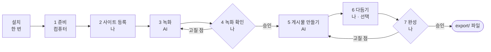

# 시작하기

[← README](../README.md)

이 문서를 따라 하면 웹사이트 1개로 인스타그램 게시물 1개 분량의 파일(1080×1440 영상·이미지 5~10개)을 만들어요.
AI가 녹화하고 만들고, 사람은 화면에서 두 번 확인해 승인해요. AI 작업은 한 프로젝트에 5~25분이고, 여기에 확인하는 시간이 더해져요.
예시는 [stuckyi.studio](https://stuckyi.studio)로 진행한 실제 화면이에요.



| 단계 | 누가 | 하는 일 | 어디서 |
|---|---|---|---|
| 설치 | 나 | 도구 설치, 저장소 받기 | 터미널 (한 번만) |
| 1. 준비 | 컴퓨터 | 설치 상태 확인 | 시작 화면이 자동으로 |
| 2. 사이트 등록 | 나 | 주소 넣기 | 시작 화면 |
| 3. 녹화 | AI | 찍을 장면을 정해 녹화 | Claude Code에 `stuckyi 하네스 시작해줘` |
| 4. 녹화 확인 | 나 | 녹화본 보고 승인 또는 고칠 점 적기 | 녹화 확인 화면 |
| 5. 게시물 만들기 | AI | 구간·속도를 정해 파일 만들고 검사 | Claude Code에 `stuckyi 이어서 해줘` |
| 6. 다듬기 (선택) | 나 | 구간·속도·배경색 고치고 내보내기 | 편집 화면 |
| 7. 완성 | 나 | 완성본 보고 승인 또는 고칠 점 적기 | 완성본 확인 화면 |

## 설치 (한 번만)

### 도구

| 도구 | 설치 |
|---|---|
| Node.js 22.2 이상 | [nodejs.org](https://nodejs.org) |
| ffmpeg | `brew install ffmpeg` (macOS, [Homebrew](https://brew.sh) 필요) |
| Claude Code | `npm install -g @anthropic-ai/claude-code` → 처음 실행할 때 로그인 |

### 저장소 받기·설치

녹화 엔진 [walkthrough-recorder](https://github.com/tadkim/walkthrough-recorder)도 함께 설치돼요.

```bash
git clone https://github.com/tadkim/ai-url-to-feed.git
cd ai-url-to-feed
npm install
npx playwright install chromium
```

### 창 두 개 열기

| 창 | 명령 | 하는 일 |
|---|---|---|
| 터미널 1 | `npm start` | 브라우저에 시작 화면이 열려요. 진행 상황, 승인 화면, 편집 화면이 모두 여기 있어요 |
| 터미널 2 | `claude` | Claude Code. AI가 녹화하고 파일을 만들 때 말을 걸어요 |

두 창 모두 **이 폴더 안에서** 실행해요. `claude`를 처음 실행하면 폴더를 신뢰할지 물어요. **신뢰(Yes)** 를 골라야 하네스 명령이 미리 허용된 상태로 동작해요.
시작 화면은 `http://127.0.0.1:4455/`이에요 (그 포트가 쓰이고 있으면 4456…, 터미널 1에 주소가 나와요). 브라우저가 안 열리면 그 주소를 직접 열어요.

## 1. 준비

시작 화면이 Node.js·ffmpeg·녹화 엔진·녹화용 브라우저를 자동으로 확인해요. 빠진 것이 있으면 첫 화면에 설치 명령이 나와요. 설치한 뒤 오른쪽 위 **다시 확인**을 눌러요.

## 2. 사이트 등록

시작 화면에 녹화할 주소를 넣고 **시작하기**를 눌러요. 주소로 프로젝트 이름이 정해져요 (`https://stuckyi.studio` → `stuckyi`).

- 배포된 사이트는 주소만 넣으면 돼요.
- 내 컴퓨터의 개발 서버(`http://localhost:4400` 등)는 서버를 먼저 띄운 뒤 넣어요. 지금 페이지 제목을 같이 기록해 다른 앱을 녹화하는 실수를 막아요.
- 다른 사이트는 왼쪽 **새 사이트**에서 더 추가해요. 프로젝트마다 따로 진행돼요.


## 3. 녹화

**지금 할 일**에 나온 문장을 **복사**해 Claude Code에 붙여 넣어요.

```text
stuckyi 하네스 시작해줘
```

AI가 사이트를 둘러보고 찍을 장면을 정해 녹화해요 (5분 안팎). 그동안 시작 화면의 3단계가 **AI가 만드는 중**으로 바뀌고, 지금 하는 일(장면 계획 → 녹화하는 중)과 걸린 시간이 보여요. 화면은 3초마다 스스로 새로 읽어요.


## 4. 녹화 확인

녹화가 끝나면 시작 화면에 **녹화 확인하러 가기**가 생겨요.


| 영역 | 내용 |
|---|---|
| 왼쪽 | 녹화본 영상. 끝까지 보면 "끝까지 봤어요"가 체크돼요. 다시 찍은 경우 이전 녹화본과 나란히 재생해 비교해요 |
| 오른쪽 | AI가 정한 에셋 계획. "장면 보기"를 누르면 그 장면으로 이동해요 |
| 아래 | **촬영 계획 승인**, 또는 고칠 점을 적고 **거절하고 다시 찍기** |

승인이든 거절이든 누른 뒤에는 Claude Code에 이렇게 말해요.

```text
stuckyi 이어서 해줘
```

거절했으면 AI가 적은 요청대로 다시 찍고 4단계로 돌아와요. 승인·거절은 화면 대신 Claude Code에 말로 해도 돼요 (`stuckyi 촬영 계획 승인` / `stuckyi 촬영 계획 거절: 버튼 사이 간격을 더 짧게`).

## 5. 게시물 만들기

AI가 녹화본에서 쓸 구간과 재생 속도를 정하고, 스크립트가 1080×1440 파일을 만든 뒤 크기·길이·빈 화면·배경색을 자동 검사해요. 그동안 5단계에 **AI가 만드는 중**과 지금 하는 일(구간·속도 정하기 → 영상·이미지 파일을 만드는 중)이 보여요. 끝나면 7단계로 넘어가요.

## 6. 다듬기 (선택)

그대로 써도 되면 건너뛰어요. 고치고 싶으면 **편집 화면에서 다듬기**를 눌러요.
구간·재생 속도·배경색을 고친 뒤 오른쪽 위 **내보내기**를 눌러요. 편집은 자동 저장되지만 **파일에는 내보내기를 눌러야 반영돼요.** 자세한 사용법은 [편집 화면](editor.md)을 봐요.

## 7. 완성

**완성본 확인하러 가기**를 눌러요.


| 보기 | 내용 |
|---|---|
| 나란히 보기 | 에셋마다 계획한 장면과 결과 파일. 다시 만든 경우 이전 결과와 달라진 점(구간·속도·화면)을 같이 보여 줘요 |
| 게시물처럼 넘겨 보기 | 인스타그램에서 넘겨 보듯 1장씩 (← → 키) |

모두 확인하고 자동 검사를 통과하면 **완성본 승인**을 누를 수 있어요. 고칠 에셋 번호를 고르고 요청을 적어 거절하면, Claude Code에 `stuckyi 이어서 해줘`라고 말해 AI가 다시 만들게 해요.

승인하면 시작 화면에 **완성됐어요**와 **결과 폴더 열기**가 보여요. `runs/stuckyi/export/`의 `01.mp4`, `02.png` … 를 순서대로 인스타그램에 올리면 돼요.

## 처음 쓸 때 막힐 수 있는 곳

| 지점 | 내용 |
|---|---|
| Claude Code 실행 | 폴더를 신뢰하지 않으면 하네스 명령마다 실행 허락을 물어요. 신뢰(Yes)를 골라요 |
| 승인·거절 (말로 할 때) | 승인·거절을 기록하는 명령은 **일부러** 매번 실행 허락을 물어요. 사람이 직접 확인하게 하려는 장치라 허용을 누르면 돼요. 화면 버튼으로 하면 묻지 않아요 |
| 화면에서 승인한 뒤 | AI는 화면 버튼을 기다리지 않아요. Claude Code에 `이어서 해줘`라고 말해야 다음 단계를 시작해요 |
| 설치 | Windows·Linux는 아직 확인 전이에요. Linux는 `npx playwright install --with-deps chromium`과 한글 폰트가 필요할 수 있어요 |
| 녹화 | 로그인이 필요한 사이트는 아직 찍을 수 없어요 |

## Claude Code에 하는 말

| 말 | 하는 일 |
|---|---|
| `<프로젝트> 하네스 시작해줘` / `이어서 해줘` | 처음부터 / 멈춘 곳부터 진행 (화면에서 승인·거절한 뒤에도) |
| `<프로젝트> 촬영 계획 승인` / `거절: <요청>` | 녹화본 확정 / 요청대로 다시 찍기 |
| `<프로젝트> 완성본 승인` / `거절: <요청>` | 끝내기 / 요청대로 다시 만들기 |
| `시작 화면 열어줘` | 시작 화면 서버를 띄우고 주소 알려 주기 |
| `<프로젝트> 계속 진행해` | 멈춘(STOP) 하네스 다시 시작 |

## 다음 단계

| 하고 싶은 것 | 방법 |
|---|---|
| 에셋 수·영상 길이 바꾸기, 저장 장면 녹화 | [설정](configuration.md)의 `asset_count`, `max_video_seconds`, `allow_writes` |
| 동작 원리 알기 | [동작 방식](how-it-works.md) |
| 막혔을 때 | [문제 해결](troubleshooting.md) |
