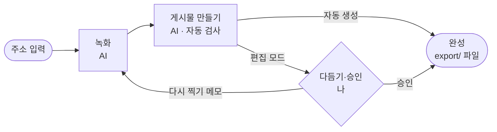

# 시작하기

[← README](../README.md)

이 문서를 따라 하면 웹사이트 1개로 인스타그램 게시물 1개 분량의 파일(1080×1440 영상·이미지 5~10개)을 만들어요.
기본은 주소만 넣으면 끝까지 자동으로 만들어요. AI 작업은 한 프로젝트에 5~25분이에요.
예시는 [stuckyi.studio](https://stuckyi.studio)로 진행한 실제 화면이에요.

## 진행 방식 고르기

주소를 넣을 때 둘 중 하나를 골라요. 나중에 시작 화면에서 언제든 바꿀 수 있어요.

| 진행 방식 | 흐름 | 내가 할 일 |
|---|---|---|
| **자동 생성** (기본) | 녹화 → 게시물 만들기 → 자동 검사 → 완성 | 없어요. 확인·승인 없이 끝나요 |
| **편집 모드** | 녹화 → 게시물 만들기 → **다듬기·승인** → 완성 | 자동으로 만든 파일을 편집 화면에서 내 취향대로 바꾸고 한 번 승인해요 |



<sub>녹화와 완성본을 둘 다 사람이 확인하는 **꼼꼼 모드**(`mode: review`)도 있어요. 시작 화면이 아니라 `projects.yaml`에서 골라요 ([설정](configuration.md)).</sub>

## 설치 (한 번만)

### 도구

| 도구 | 설치 |
|---|---|
| Node.js 22.2 이상 | [nodejs.org](https://nodejs.org) |
| ffmpeg | `brew install ffmpeg` (macOS, [Homebrew](https://brew.sh) 필요) |
| Claude Code | `npm install -g @anthropic-ai/claude-code` → 처음 실행할 때 로그인 |

### 저장소 받기·설치

녹화 엔진 [walkthrough-recorder](https://github.com/tadkim/walkthrough-recorder)도 함께 설치돼요.

```bash
git clone https://github.com/tadkim/ai-url-to-feed.git
cd ai-url-to-feed
npm install
npx playwright install chromium
```

### 창 두 개 열기

| 창 | 명령 | 하는 일 |
|---|---|---|
| 터미널 1 | `npm start` | 브라우저에 시작 화면이 열려요. 진행 상황, 결과 보기, 편집 화면이 모두 여기 있어요 |
| 터미널 2 | `claude` | Claude Code. AI가 녹화하고 파일을 만들 때 말을 걸어요 |

두 창 모두 **이 폴더 안에서** 실행해요. `claude`를 처음 실행하면 폴더를 신뢰할지 물어요. **신뢰(Yes)** 를 골라야 하네스 명령이 미리 허용된 상태로 동작해요.
시작 화면은 `http://127.0.0.1:4455/`이에요 (그 포트가 쓰이고 있으면 4456…, 터미널 1에 주소가 나와요). 브라우저가 안 열리면 그 주소를 직접 열어요.

## 1. 준비

시작 화면이 Node.js·ffmpeg·녹화 엔진·녹화용 브라우저를 자동으로 확인해요. 빠진 것이 있으면 첫 화면에 설치 명령이 나와요. 설치한 뒤 오른쪽 위 **다시 확인**을 눌러요.

## 2. 사이트 등록

시작 화면에 녹화할 주소를 넣고, 진행 방식을 고른 뒤 **시작하기**를 눌러요. `https://`는 빼고 `stuckyi.studio`처럼 넣어도 돼요 (내 컴퓨터 주소 `localhost:3000`은 `http://`가 붙어요). 주소로 프로젝트 이름이 정해져요 (`stuckyi.studio` → `stuckyi`).

- 배포된 사이트는 주소만 넣으면 돼요.
- 내 컴퓨터의 개발 서버(`http://localhost:4400` 등)는 서버를 먼저 띄운 뒤 넣어요. 지금 페이지 제목을 같이 기록해 다른 앱을 녹화하는 실수를 막아요.
- 다른 사이트는 왼쪽 **새 사이트**에서 더 추가해요. 프로젝트마다 따로 진행돼요.


## 3. 녹화 · 4. 게시물 만들기 (AI)

**지금 할 일**에 나온 문장을 **복사**해 Claude Code에 붙여 넣어요. 이 한 번으로 끝까지 진행돼요.

```text
stuckyi 하네스 시작해줘
```

1. AI가 사이트를 둘러보고 찍을 장면을 정해 녹화해요 (5분 안팎).
2. AI가 녹화본에서 쓸 구간과 재생 속도를 정하고, 스크립트가 1080×1440 파일을 만든 뒤 크기·길이·빈 화면·배경색을 자동 검사해요.

그동안 시작 화면의 그 단계가 **AI가 만드는 중**으로 바뀌고, 지금 하는 일과 걸린 시간이 보여요. 화면은 3초마다 스스로 새로 읽어요.


녹화 원본은 게시물의 재료라 30초가 넘어도 괜찮아요. 게시물 영상은 이 중 필요한 부분만 20초 이하로 잘라 만들어요.

## 5. 완성 (자동 생성)

자동 검사를 통과하면 바로 **완성됐어요**가 보여요. **결과 폴더 열기**로 `runs/stuckyi/export/`의 `01.mp4`, `02.png` … 를 열어 순서대로 인스타그램에 올리면 돼요.
**결과 보기**에서 게시물처럼 넘겨 볼 수 있어요. 다듬고 싶어지면 **편집 모드로 바꿔 다듬기**를 눌러요.

## 5. 다듬기·승인 (편집 모드)

편집 모드는 파일을 만든 뒤 멈추고 **편집 화면에서 다듬기**를 보여 줘요.


| 하고 싶은 것 | 방법 |
|---|---|
| 구간·재생 속도·배경색·테두리 바꾸기 | **편집 화면**에서 고친 뒤 오른쪽 위 **내보내기**. 파일에는 내보내기를 눌러야 반영돼요 ([편집 화면](editor.md)) |
| 결과를 게시물처럼 넘겨 보기 | **완성본 확인**의 "게시물처럼 넘겨 보기" (← → 키) |
| 장면 자체를 다시 찍기 | **녹화 원본 보기**에서 장면 옆 말풍선 버튼으로 메모 → **메모 보내고 다시 찍기** → Claude Code에 `stuckyi 이어서 해줘` |
| AI에게 다시 편집 맡기기 | 완성본 확인에서 고칠 에셋 번호와 요청을 적어 **거절하고 요청하기** → `stuckyi 이어서 해줘` |

다 됐으면 **완성본 확인**에서 **완성본 승인**을 눌러요. 승인하면 **완성됐어요**와 **결과 폴더 열기**가 보여요.

## 꼼꼼 모드 (review)

`projects.yaml`에서 `mode: review`로 두면 녹화가 끝난 뒤에도 한 번 멈춰요. **녹화 확인** 화면에서 녹화마다 AI가 남긴 주요 장면 3~5개(썸네일 + 무엇을 어떻게 찍었는지)를 훑어보고 승인해요.


| 하고 싶은 것 | 방법 | 다시 찍나요 |
|---|---|---|
| 빠르게 훑어보기 | 주요 장면을 누르면 그 부분부터 2배속으로 재생돼요 | — |
| 에셋 빼기·순서·설명 바꾸기 | 오른쪽 **게시물 에셋** 표에서 바로 | 아니요 |
| 마음에 드는 순간을 에셋으로 | 주요 장면 옆 이미지 추가 버튼 | 아니요 |
| 조작 속도·장면 자체 바꾸기 | 장면에 메모, 또는 "조작을 더 빠르게" 같은 빠른 선택 | 네 |

## 처음 쓸 때 막힐 수 있는 곳

| 지점 | 내용 |
|---|---|
| Claude Code 실행 | 폴더를 신뢰하지 않으면 하네스 명령마다 실행 허락을 물어요. 신뢰(Yes)를 골라요 |
| 승인·거절 (편집·꼼꼼 모드, 말로 할 때) | 승인·거절을 기록하는 명령은 **일부러** 매번 실행 허락을 물어요. 허용을 누르면 돼요. 화면 버튼으로 하면 묻지 않아요 |
| 화면에서 승인·다시 찍기를 누른 뒤 | AI는 화면 버튼을 기다리지 않아요. Claude Code에 `이어서 해줘`라고 말해야 다음 단계를 시작해요 |
| 설치 | Windows·Linux는 아직 확인 전이에요. Linux는 `npx playwright install --with-deps chromium`과 한글 폰트가 필요할 수 있어요 |
| 녹화 | 로그인이 필요한 사이트는 아직 찍을 수 없어요 |

## Claude Code에 하는 말

| 말 | 하는 일 |
|---|---|
| `<프로젝트> 하네스 시작해줘` / `이어서 해줘` | 처음부터 / 멈춘 곳부터 진행 (화면에서 승인·거절한 뒤에도) |
| `<프로젝트> 편집 모드로 바꿔줘` / `자동 생성으로 바꿔줘` | 진행 방식 바꾸기 (시작 화면에서도 돼요) |
| `<프로젝트> 촬영 계획 거절: <요청>` | 요청대로 다시 찍기 (꼼꼼 모드는 `촬영 계획 승인`도) |
| `<프로젝트> 완성본 승인` / `거절: <요청>` | 편집·꼼꼼 모드: 끝내기 / 요청대로 다시 만들기 |
| `시작 화면 열어줘` | 시작 화면 서버를 띄우고 주소 알려 주기 |
| `<프로젝트> 계속 진행해` | 멈춘(STOP) 하네스 다시 시작 |

## 다음 단계

| 하고 싶은 것 | 방법 |
|---|---|
| 에셋 수·영상 길이 바꾸기, 저장 장면 녹화 | [설정](configuration.md)의 `asset_count`, `max_video_seconds`, `allow_writes` |
| 동작 원리 알기 | [동작 방식](how-it-works.md) |
| 막혔을 때 | [문제 해결](troubleshooting.md) |
