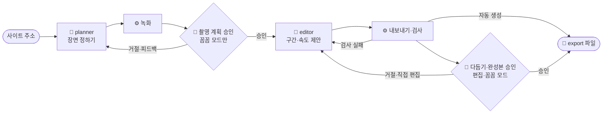

# 동작 방식

[← README](../README.md)

## 하네스와 에이전트

**하네스**는 AI가 정해진 순서와 기준대로 일하게 묶어 두는 틀이에요. 일은 셋이 나눠 맡아요.

| 누가 | 맡는 일 | 예 |
|---|---|---|
| 🧠 AI 에이전트 | 판단이 필요한 일 | **planner**: 찍을 장면 정하기 · **editor**: 쓸 구간·속도 제안 |
| ⚙️ 스크립트 | 정해진 일과 판정 | 녹화, 파일 만들기, 크기·길이·빈 화면 검사 |
| 🙋 사람 | 고르기·다듬기 | 진행 방식 고르기. 편집 모드면 편집 화면에서 다듬고 완성본 승인 (자동 생성은 할 일 없음) |

에이전트는 계획만 쓰고 실제 녹화와 파일 만들기는 스크립트가 해요. 그래서 같은 계획이면 언제 돌려도 같은 결과가 나와요.

## 명령줄과 Claude Code

`npx ai-url-to-feed <주소>`(scripts/cli.mjs)는 이렇게 진행해요.

1. 실행 환경(Node·ffmpeg·chromium)을 확인하고, 주소와 옵션(`--bg`, `--count`, `--edit`)을 `projects.yaml`에 적어요.
2. 이 폴더에서 Claude Code를 화면 없이 띄워요: `claude -p "<프로젝트> 하네스 시작해줘" --permission-mode acceptEdits --allowedTools <허용 목록>`. 다음부터는 `이어서 해줘`예요.
3. Claude Code는 [CLAUDE.md](../CLAUDE.md)의 순서대로 planner·editor 에이전트와 스크립트를 돌려요. 대화로 진행할 때와 같은 순서예요.
4. 그동안 명령줄은 2초마다 상태(`run.mjs status`)와 지금 도는 작업(에이전트·녹화·내보내기 표시)을 읽어 진행 막대로 보여 줘요. 다섯 단계(장면 계획 → 녹화 → 구간·속도 정하기 → 파일 만들기 → 자동 검사)가 끝날 때마다 막대 위에 한 줄씩 남아요. 터미널이 아니면(파이프·로그 파일) 바뀐 순간만 한 줄씩 찍고, 진행 기록은 `runs/.harness/log/<프로젝트>-cli.jsonl`에 남아요. Claude Code가 끝났는데 아직 완성 전이면 `이어서 해줘`로 두 번까지 더 띄워요.
5. 완성되면 파일 목록과 걸린 시간, Claude Code 사용량(`total_cost_usd`, API 요금 기준)을, 멈추면 이유와 `continue` 명령을 보여 줘요. 편집·꼼꼼 모드면 승인할 화면을 열어요.

planner는 시간 예산을 지켜요 (explore 6회·try 3회·도구 호출 30회·6분 목표). 여러 화면을 `explore.mjs --batch`로 한 번에 보고, 시나리오는 `try.mjs`로 한꺼번에 동시에 돌려 봐요. 이 도구들이 남기는 활동 기록(`.cache/activity/`)이 진행 막대에 "화면 12개 둘러봄"처럼 보여요.

| 권한 | 내용 |
|---|---|
| 실행할 수 있는 명령 | `.claude/settings.json`의 허용 목록(하네스 스크립트)만. 명령줄이 이 목록을 `--allowedTools`로 직접 넘겨서, 폴더를 신뢰(trust)한 적이 없어도 돼요 |
| 파일 편집 | 묻지 않고 허용 (`acceptEdits`). 에이전트가 자기 범위 밖 파일을 고치면 `run.mjs end`가 잡아 멈춰요 |
| 승인·거절 | 명령줄은 스스로 하지 않아요. `retake`처럼 사람이 친 명령, 또는 화면 버튼일 때만 기록해요 |

Claude Code가 한 일은 `runs/.harness/log/<프로젝트>-claude.log`에 남아요.

### 멈추기와 삭제

- 명령줄은 Claude Code를 자기 프로세스 묶음으로 띄워요. Ctrl+C나 삭제로 멈추면 그 묶음째(에이전트가 돌리던 도구·브라우저까지) 꺼서 남는 프로세스가 없어요.
- 삭제(시작 화면의 **삭제** 또는 `npx ai-url-to-feed delete <프로젝트>`)는 이름을 똑같이 입력해야 해요. 진행 중이면 명령줄 → Claude Code 묶음 → 녹화·내보내기 순서로 멈춘 뒤, `projects.yaml` 등록, `runs/<프로젝트>/`, 진행 상태·기록, `.cache/`의 확인용 화면을 지워요. 게시물 파일만 `runs/_kept/<프로젝트>-<시각>/`로 남길 수 있어요.
- 대화창의 Claude Code에서 진행 중인 작업은 여기서 멈출 수 없어서, 확인 창이 그 창을 직접 멈추라고 알려 줘요.

## 흐름



- 통과·실패는 AI가 아니라 ⚙️ 검사 스크립트가 정해요.
- 여러 번 실패하거나, 거절했는데 아무것도 바뀌지 않으면 멈추고 사람에게 물어요.
- 다음에 할 일은 항상 상태(`npm run status -- <프로젝트>`, 사람이 볼 때는 `npx ai-url-to-feed status <프로젝트>`)로 정해요. 중간에 멈춰도 그 지점부터 이어서 할 수 있어요.
- 사람이 멈춰서 확인하는 지점은 진행 방식(`mode`)이 정해요.

| 진행 방식 | 멈추는 곳 | 시작 화면 단계 |
|---|---|---|
| 자동 생성 `auto` (기본) | 없음 | 준비 → 사이트 등록 → 녹화 → 게시물 만들기 → 완성 |
| 편집 모드 `edit` | 완성본 (다듬기·승인) | … → 게시물 만들기 → 다듬기·승인 → 완성 |
| 꼼꼼 모드 `review` | 녹화, 완성본 | … → 녹화 → 녹화 확인 → 게시물 만들기 → 다듬기 → 완성 |

- 시작 화면의 단계는 이 상태를 사람 기준으로 묶어 보여 줘요 (녹화 = planner·녹화, 게시물 만들기 = editor·내보내기·검사).
- 명령줄의 진행 막대는 같은 상태를 다섯 단계로 더 잘게 보여 줘요: 장면 계획(planner) → 녹화 → 구간·속도 정하기(editor) → 파일 만들기 → 자동 검사.

## 화면 (선택)

`npx ai-url-to-feed ui`(= `npm start`)가 띄우는 로컬 화면이에요 (127.0.0.1에서만 열려요). `--edit`로 실행하면 다 만든 뒤 편집 화면이 자동으로 열려요.

| 화면 | 주소 | 하는 일 |
|---|---|---|
| 시작 화면 | `/` | 주소·진행 방식 등록, 단계별 진행 상황(눌러서 체크 항목), 지금 할 일, 지금까지 찍은 장면, 완성 뒤 올릴 순서, 진행 방식 바꾸기 |
| 녹화 확인 · 녹화 원본 | `/p/<프로젝트>/approve/plan` | 녹화마다 주요 장면(AI 코멘트) 보기, 다시 찍기 메모. 꼼꼼 모드는 에셋 수정과 촬영 계획 승인도 |
| 완성본 확인 · 결과 보기 | `/p/<프로젝트>/approve/final` | 결과 파일을 게시물처럼 넘겨 보기(기본) 또는 한눈에 나란히 보기. 편집·꼼꼼 모드는 완성본 승인·거절 |
| 편집 화면 | `/p/<프로젝트>/edit/` | 구간·속도·배경색 고치기, 내보내기 |

- 화면의 승인·거절 버튼은 Claude Code에 "승인" / "거절: 요청"이라고 말한 것과 같은 기록을 남겨요. 승인은 화면을 연 뒤 내용이 바뀌지 않았을 때만 돼요.
- 거절하면 그 직전 결과를 `history/`에 남겨, 다시 만든 결과와 나란히 비교할 수 있어요.
- AI 에이전트가 일하거나 녹화·내보내기가 도는 동안에는 그 단계에 "AI가 만드는 중"이 보여요 (`runs/.harness/`의 실행 표시를 읽어요).
- AI는 화면 버튼을 기다리지 않아요. 누른 뒤 같은 명령(`npx ai-url-to-feed <주소>`)을 다시 실행하거나 Claude Code에 `<프로젝트> 이어서 해줘`라고 말하면 다음 단계를 진행해요.

## 단계별 결과

| 단계 | 하는 쪽 | 결과 (`runs/<프로젝트>/`) |
|---|---|---|
| 촬영 계획 | 🧠 planner | `plan/` 에셋 목록·녹화 시나리오 |
| 녹화 | ⚙️ 스크립트 | `raw/` 1080×1920 녹화본·장면 모음 |
| 촬영 계획 승인 (꼼꼼 모드) | 🙋 사람 | `gate/` 승인 기록 |
| 편집값 제안 | 🧠 editor | `edit/edits.json` |
| 내보내기·검사 | ⚙️ 스크립트 | `export/` 게시물 파일, `gate/` 검사 결과 |
| 완성본 승인 (편집·꼼꼼 모드) | 🙋 사람 | `gate/` 승인 기록 |

## 자동 검사

| 검사 | 확인하는 것 |
|---|---|
| 파일 규격 | 1080×1440 크기, H.264·30fps 영상과 PNG 이미지 |
| 영상 길이 | 너무 짧거나 최대 길이(기본 20초)를 넘지 않는지 |
| 빈 화면 | 영상의 첫·마지막 장면과 이미지가 화면 전환 중의 빈 화면이 아닌지 |
| 배경색 일치 | 모든 에셋의 배경이 같은 색인지 |
| 지정한 배경색 | `--bg`(projects.yaml `bg`)로 정한 색을 editor가 썼는지. 편집 화면에서 직접 바꾼 색은 검사하지 않아요 |
| 같은 화면 반복 | 서로 다른 에셋에 같은 화면이 들어가지 않았는지 (영상 구간 5곳·이미지 화면끼리 비교, PSNR 35dB 이상이면 같은 화면) |
| 멈춘 영상 | 영상 구간 안에서 화면이 실제로 바뀌는지 (구간 5곳이 모두 첫 화면과 PSNR 38dB 이상이면 거의 멈춘 영상이라 이미지로 쓰게 해요) |
| 반복 이음새 | 반복 재생 영상의 끝과 처음이 자연스럽게 이어지는지 |

두 기준값은 실제로 만든 결과 네 벌에서 잰 값으로 정했어요 (서로 다른 화면 ≤ 23dB, 겹친 화면 42~46dB, 실제 영상의 움직임 ≤ 27dB). 화면 내용이 의도한 장면인지(예: "4개가 다 찬 목록")는 검사하지 않아요. 자동 생성은 AI가 프레임을 직접 보고 고르고, 편집·꼼꼼 모드는 사람이 승인할 때 봐요.

## 폴더와 파일

```text
runs/my-site/          ← 프로젝트마다 하나 (git에 올라가지 않아요)
├── plan/                 🧠 planner   에셋 목록, 녹화 시나리오
├── raw/                  ⚙️ 녹화      1080×1920 녹화본, 장면 모음
├── edit/edits.json       🧠 editor + 🙋 편집 화면   구간·속도·배경색
├── export/               ⚙️ 내보내기  01.mp4, 02.png … ← 게시할 파일
├── gate/                 ⚙️ 검사      검사 결과, 승인 기록
└── history/              ⚙️ 거절 전 결과 (비교용, 최근 3개)
```

| 파일 | 내용 |
|---|---|
| `prd.md`, `story-*.md` | 무엇을 왜 만드는지, 지켜야 할 것 (설계 기록) |
| `rules.yaml` | 규격·검사 기준 숫자 (숫자는 여기에만) |
| `projects.example.yaml` | 프로젝트 등록 예시 (명령줄이나 시작 화면에서 주소를 넣으면 `projects.yaml`이 자동으로 생겨요) |
| `CLAUDE.md`, `.claude/agents/` | Claude가 따르는 진행 순서, 에이전트 지시문 |
| `scripts/` | 둘러보기·녹화·내보내기·검사 |
| `scripts/cli.mjs`, `scripts/projects.mjs` | 명령줄 (`npx ai-url-to-feed`), projects.yaml 등록·설정 |
| `scripts/app.mjs`, `scripts/ui/`, `scripts/review.html` | 시작 화면·승인 화면·편집 화면 (아이콘은 [Lucide](https://lucide.dev)) |
| `scripts/make-demo.mjs` | README·문서의 미리보기(GIF·화면 캡처)를 실제 화면으로 다시 만들기 (`node scripts/make-demo.mjs <완성한 프로젝트>`) |
| `scripts/make-cli-demo.mjs`, `docs/assets/cli-run.txt` | README 맨 위 터미널 미리보기. 명령줄을 실제로 실행한 출력(`cli-run.txt`)을 터미널 모양으로 재생해 녹화해요 (`node scripts/make-cli-demo.mjs`) |
| `.cache/` | AI가 확인용으로 뽑는 화면·프레임 (git에 올라가지 않아요) |
