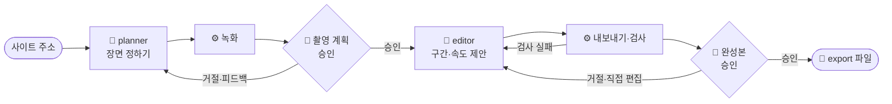

# 동작 방식

[← README](../README.md)

## 하네스와 에이전트

**하네스**는 AI가 정해진 순서와 기준대로 일하게 묶어 두는 틀이에요. 일은 셋이 나눠 맡아요.

| 누가 | 맡는 일 | 예 |
|---|---|---|
| 🧠 AI 에이전트 | 판단이 필요한 일 | **planner**: 찍을 장면 정하기 · **editor**: 쓸 구간·속도 제안 |
| ⚙️ 스크립트 | 정해진 일과 판정 | 녹화, 파일 만들기, 크기·길이·빈 화면 검사 |
| 🙋 사람 | 최종 결정 | 녹화본 승인, 완성본 승인 (Claude Code에 말로) |

에이전트는 계획만 쓰고 실제 녹화와 파일 만들기는 스크립트가 해요. 그래서 같은 계획이면 언제 돌려도 같은 결과가 나와요.

## 흐름



- 통과·실패는 AI가 아니라 ⚙️ 검사 스크립트가 정해요.
- 여러 번 실패하거나, 거절했는데 아무것도 바뀌지 않으면 멈추고 사람에게 물어요.
- 다음에 할 일은 항상 `npm run status -- <프로젝트>`로 정해요. 중간에 멈춰도 그 지점부터 이어서 할 수 있어요.

## 단계별 결과

| 단계 | 하는 쪽 | 결과 (`runs/<프로젝트>/`) |
|---|---|---|
| 촬영 계획 | 🧠 planner | `plan/` 에셋 목록·녹화 시나리오 |
| 녹화 | ⚙️ 스크립트 | `raw/` 1080×1920 녹화본·장면 모음 |
| 촬영 계획 승인 | 🙋 사람 | `gate/` 승인 기록 |
| 편집값 제안 | 🧠 editor | `edit/edits.json` |
| 내보내기·검사 | ⚙️ 스크립트 | `export/` 게시물 파일, `gate/` 검사 결과 |
| 완성본 승인 | 🙋 사람 | `gate/` 승인 기록 |

## 자동 검사

| 검사 | 확인하는 것 |
|---|---|
| 파일 규격 | 1080×1440 크기, H.264·30fps 영상과 PNG 이미지 |
| 영상 길이 | 너무 짧거나 최대 길이(기본 20초)를 넘지 않는지 |
| 빈 화면 | 영상의 첫·마지막 장면과 이미지가 화면 전환 중의 빈 화면이 아닌지 |
| 배경색 일치 | 모든 에셋의 배경이 같은 색인지 |
| 반복 이음새 | 반복 재생 영상의 끝과 처음이 자연스럽게 이어지는지 |

화면 내용이 의도한 장면인지(예: "4개가 다 찬 목록")는 검사하지 않아요. 그건 사람이 승인할 때 봐요.

## 폴더와 파일

```text
runs/my-site/          ← 프로젝트마다 하나 (git에 올라가지 않아요)
├── plan/                 🧠 planner   에셋 목록, 녹화 시나리오
├── raw/                  ⚙️ 녹화      1080×1920 녹화본, 장면 모음
├── edit/edits.json       🧠 editor + 🙋 편집 화면   구간·속도·배경색
├── export/               ⚙️ 내보내기  01.mp4, 02.png … ← 게시할 파일
└── gate/                 ⚙️ 검사      검사 결과, 승인 기록
```

| 파일 | 내용 |
|---|---|
| `prd.md`, `story-*.md` | 무엇을 왜 만드는지, 지켜야 할 것 (설계 기록) |
| `rules.yaml` | 규격·검사 기준 숫자 (숫자는 여기에만) |
| `projects.example.yaml` | 프로젝트 등록 예시 |
| `CLAUDE.md`, `.claude/agents/` | Claude가 따르는 진행 순서, 에이전트 지시문 |
| `scripts/` | 둘러보기·녹화·내보내기·검사·편집 화면 |
| `scripts/make-demo.mjs` | README의 미리보기 GIF 다시 만들기 (`node scripts/make-demo.mjs <프로젝트>`) |
| `.cache/` | AI가 확인용으로 뽑는 화면·프레임 (git에 올라가지 않아요) |
